# Kịch Bản Kiểm Thử Tích Hợp Toàn Diện (End-to-End API Test Script)

Kịch bản này được thiết kế để mô phỏng toàn bộ luồng vận hành của hệ thống **Mini-Logistic** dưới góc nhìn của một Kỹ sư Kiểm thử Tự động hóa (API Automation Test Engineer). 

---

## PHẦN 1: SEEDING DATA & INITIALIZATION (Khởi Tạo Hệ Thống)

Sau khi cài đặt mới ứng dụng (Fresh installation), các dữ liệu nền cấu trúc danh mục và phân quyền cần được tạo lập.

| Bước | API Endpoint | HTTP Method | Mục Đích | Token Quyền |
| :--- | :--- | :--- | :--- | :--- |
| **1.1** | `/api/v1/auth/login` | `POST` | Đăng nhập Admin hệ thống mặc định (seed sẵn) để lấy Access Token khởi tạo. | Không yêu cầu |
| **1.2** | `/api/v1/nodes` | `POST` | Khởi tạo các Node cơ sở hạ tầng (Manufacturer, Distributor, Retailer). | Admin |
| **1.3** | `/api/v1/products` | `POST` | Khởi tạo danh mục sản phẩm thương mại. | Admin |

### Chi Tiết Request & Response Khởi Tạo

#### Bước 1.1: Đăng nhập Admin Gốc để lấy Token
*   **Request Headers**:
    ```http
    Content-Type: application/json
    ```
*   **Request Body**:
    ```json
    {
      "email": "admin@logistic.com",
      "password": "password123"
    }
    ```
*   **Expected Response (`200 OK`)**:
    ```json
    {
      "accessToken": "eyAdminToken..."
    }
    ```

#### Bước 1.2: Khởi tạo các Node hạ tầng (Tạo các Node mẫu)
##### 1. Tạo Node Manufacturer:
*   **Request Body**:
    ```json
    {
      "name": "Nhà máy Sản xuất Dược A",
      "nodeType": "MANUFACTURER",
      "address": "123 Khu Công nghiệp, Hà Nội",
      "latitude": 21.0285,
      "longitude": 105.8542
    }
    ```
*   **Expected Response (`201 Created`)**:
    ```json
    {
      "id": "e3000000-0000-0000-0000-000000000001",
      "name": "Nhà máy Sản xuất Dược A",
      "nodeType": "MANUFACTURER",
      "address": "123 Khu Công nghiệp, Hà Nội",
      "latitude": 21.0285,
      "longitude": 105.8542,
      "isActive": true,
      "version": 1
    }
    ```

##### 2. Tạo Node Distributor:
*   **Request Body**:
    ```json
    {
      "name": "Kho Phân Phối Miền Bắc",
      "nodeType": "DISTRIBUTOR",
      "address": "456 Cảng Logistics, Hải Phòng",
      "latitude": 20.8449,
      "longitude": 106.6881
    }
    ```
*   **Expected Response (`201 Created`)**:
    ```json
    {
      "id": "e3000000-0000-0000-0000-000000000002",
      "name": "Kho Phân Phối Miền Bắc",
      "nodeType": "DISTRIBUTOR",
      "address": "456 Cảng Logistics, Hải Phòng",
      "latitude": 20.8449,
      "longitude": 106.6881,
      "isActive": true,
      "version": 1
    }
    ```

##### 3. Tạo Node Retailer:
*   **Request Body**:
    ```json
    {
      "name": "Nhà Thuốc Retailer C",
      "nodeType": "RETAILER",
      "address": "789 Đường Nguyễn Trãi, Hà Nội",
      "latitude": 20.9984,
      "longitude": 105.7981
    }
    ```
*   **Expected Response (`201 Created`)**:
    ```json
    {
      "id": "e3000000-0000-0000-0000-000000000003",
      "name": "Nhà Thuốc Retailer C",
      "nodeType": "RETAILER",
      "address": "789 Đường Nguyễn Trãi, Hà Nội",
      "latitude": 20.9984,
      "longitude": 105.7981,
      "isActive": true,
      "version": 1
    }
    ```

#### Bước 1.3: Khởi tạo Sản phẩm Danh mục (Master Data)
*   **Request Body**:
    ```json
    {
      "name": "Vắc-xin Influenza",
      "sku": "VAC-INF-001",
      "unit": "Hộp",
      "description": "Vắc-xin phòng cúm mùa",
      "category": "Dược phẩm"
    }
    ```
*   **Expected Response (`201 Created`)**:
    ```json
    {
      "id": "p0000000-0000-0000-0000-000000000001",
      "name": "Vắc-xin Influenza",
      "sku": "VAC-INF-001",
      "unit": "Hộp",
      "description": "Vắc-xin phòng cúm mùa",
      "category": "Dược phẩm",
      "isActive": true
    }
    ```

---

## PHẦN 2: ROLE-BASED API TESTING (Kiểm Thử Toàn Bộ API)

Bảng dưới đây mô tả chi tiết quyền hạn và phản hồi kỳ vọng của **từng vai trò** đối với **tất cả API** trong hệ thống. Điều này giúp kiểm thử khả năng bảo mật, RLS và phân quyền ranh giới Node (Node isolation).

| STT | API Endpoint | HTTP Method | Vai Trò Gọi | Dữ Liệu Body / Params / Query | Kết Quả Kỳ Vọng | Giải Thích Nghiệp Vụ / Security |
| :--- | :--- | :--- | :--- | :--- | :--- | :--- |
| **1** | `/api/v1/auth/login` | `POST` | Công Khai | `{"email": "...", "password": "..."}` | `200 OK` + `accessToken` | Không cần token, trả về JWT hợp lệ |
| **2** | `/api/v1/auth/me` | `GET` | Mọi Role | Trống | `200 OK` + Thông tin User | Trả về thông tin chi tiết user & role hiện tại |
| **3** | `/api/v1/auth/logout` | `POST` | Mọi Role | Trống | `200 OK` | Đăng xuất, hủy phiên làm việc |
| **4** | `/api/v1/users` | `POST` | Admin | `{"email": "...", "role": "Distributor"}` | `201 Created` + `temporaryPassword` | Chỉ Admin được tạo nhân sự mới |
| | | | Manufacturer | Giống trên | `403 Forbidden` | Từ chối quyền tạo tài khoản |
| **5** | `/api/v1/users` | `GET` | Admin | Trống (Phân trang) | `200 OK` + List User | Chỉ Admin được xem toàn bộ user |
| | | | Retailer | Trống | `403 Forbidden` | Nhân viên không được xem danh sách đồng nghiệp |
| **6** | `/api/v1/users/:id` | `PUT` | Admin | `{"fullName": "Sửa Tên"}` | `200 OK` | Sửa thông tin nhân sự |
| | | | Distributor | Giống trên | `403 Forbidden` | Chặn chỉnh sửa tài khoản trái phép |
| **7** | `/api/v1/users/:id/toggle-active` | `PATCH` | Admin | Route Param `:id` | `200 OK` | Kích hoạt/Vô hiệu hóa (Soft disable) tài khoản |
| | | | Manufacturer | Route Param `:id` | `403 Forbidden` | Chỉ Admin quản trị tài khoản |
| **8** | `/api/v1/users/:id/reset-password` | `POST` | Admin | Route Param `:id` | `200 OK` + `temporaryPassword` mới | Không reset được tài khoản Admin khác |
| | | | Retailer | Route Param `:id` | `403 Forbidden` | Chặn reset mật khẩu trái phép |
| **9** | `/api/v1/nodes` | `POST` | Admin | `{"name": "Node Mới", "latitude": 21.0}` | `201 Created` | Thêm điểm nút cung ứng mới kèm GPS |
| | | | Distributor | Giống trên | `403 Forbidden` | Chặn thay đổi cấu trúc mạng lưới |
| **10**| `/api/v1/nodes` | `GET` | Mọi Role | Query: `includeInventory=true` | `200 OK` | Xem danh sách các điểm nút và tồn kho |
| **11**| `/api/v1/nodes/:id` | `PUT` | Admin | `{"name": "Sửa", "version": 1}` | `200 OK` / `409 Conflict` | Optimistic locking tránh tranh chấp dữ liệu |
| | | | Manufacturer | Giống trên | `403 Forbidden` | Chặn cập nhật điểm nút |
| **12**| `/api/v1/nodes/:id` | `DELETE` | Admin | Route Param `:id` | `204 No Content` / `400 Bad Request` | Xóa mềm. Báo lỗi 400 nếu node vẫn còn tồn kho |
| **13**| `/api/v1/products` | `POST` | Admin | `{"name": "Thuốc B", "sku": "SKU-B"}` | `201 Created` | Đăng ký danh mục sản phẩm mới |
| | | | Manufacturer | Giống trên | `403 Forbidden` | Nhà máy chỉ sản xuất chứ không tạo danh mục sản phẩm |
| **14**| `/api/v1/products` | `GET` | Mọi Role | Trống | `200 OK` | Xem danh sách sản phẩm |
| **15**| `/api/v1/products/:id` | `GET` | Mọi Role | Route Param `:id` | `200 OK` | Xem chi tiết sản phẩm |
| **16**| `/api/v1/products/:id` | `PUT` | Admin | `{"name": "Tên Mới"}` | `200 OK` | Sửa sản phẩm |
| **17**| `/api/v1/products/:id` | `DELETE` | Admin | Route Param `:id` | `204 No Content` | Xóa mềm sản phẩm |
| **18**| `/api/v1/batches` | `POST` | Manufacturer | `{"productId": "...", "quantity": 100}` | `201 Created` | Khởi tạo lô sản xuất, sinh QR Code và timeline |
| | | | Distributor | Giống trên | `403 Forbidden` | Nhà phân phối không được tự tạo lô hàng mới |
| **19**| `/api/v1/batches/:id/sell` | `POST` | Retailer | `{"quantity": 10}` | `200 OK` | Trừ kho bán lẻ. Nếu tồn kho = 0 đổi trạng thái thành SOLD |
| | | | Manufacturer | Giống trên | `403 Forbidden` | Nhà sản xuất không được trực tiếp bán lẻ |
| **20**| `/api/v1/batches` | `GET` | Admin | Trống | `200 OK` (Thấy hết) | Tra cứu danh sách lô hàng có phân trang |
| | | | Manufacturer | Trống | `200 OK` (RLS filter) | Chỉ thấy các lô hàng sản xuất tại nhà máy mình |
| | | | Retailer | Trống | `200 OK` (RLS filter) | Chỉ thấy lô hàng đã từng đi qua/nhập kho mình |
| **21**| `/api/v1/batches/:id` | `GET` | Manufacturer | Lô hàng của mình | `200 OK` | Xem chi tiết lô hàng và QR Code |
| | | | Distributor | Lô hàng chưa từng đi qua kho | `403 Forbidden` | RLS bảo mật hạn chế xem lô hàng không thuộc scope |
| **22**| `/api/v1/batches/:id/timeline` | `GET` | Mọi Role | Route Param `:id` | `200 OK` | Lịch sử chuỗi sự kiện bất biến sắp xếp tăng dần |
| **23**| `/api/v1/batches/:id/regenerate-qr` | `POST`| Manufacturer | Route Param `:id` | `200 OK` | Tạo lại ảnh QR code SVG/PNG |
| **24**| `/api/v1/shipments` | `POST` | Manufacturer | `{"batchId": "...", "quantityShipped": 50}` | `201 Created` | Tạo vận đơn xuất kho. Bắt buộc Pessimistic Lock |
| | | | Retailer | Giống trên | `403 Forbidden` | Cửa hàng bán lẻ không được tạo vận đơn trung chuyển |
| **25**| `/api/v1/shipments/:id/receive` | `PATCH` | Distributor | Gán với `dest_node_id` vận đơn | `200 OK` | Xác nhận nhận hàng. UPSERT kho đích, đổi trạng thái |
| | | | Distributor | KHÔNG gán với `dest_node_id` | `403 Forbidden` | Ranh giới Node ngăn chặn ký nhận hộ |
| **26**| `/api/v1/shipments` | `GET` | Distributor | Trống | `200 OK` (RLS filter) | Xem danh sách vận đơn xuất đi hoặc chuyển đến node mình |
| **27**| `/api/v1/shipments/:id` | `GET` | Retailer | Vận đơn của mình | `200 OK` | Xem chi tiết vận đơn |
| **28**| `/api/v1/incidents` | `POST` | Admin | `{"shipmentId": "...", "incidentType": "MISSING"}`| `201 Created` | Báo cáo sự cố, đóng băng lô hàng sang INVESTIGATING |
| | | | Retailer | Giống trên | `403 Forbidden` | Chặn user báo cáo sự cố sai quyền |
| **29**| `/api/v1/incidents/:id/confirm-lost`| `POST` | Admin 2 | Route Param `:id` | `200 OK` | Two-Man Rule: Hoàn trả kho nguồn, đổi trạng thái LOST |
| | | | Admin 1 (Báo cáo) | Route Param `:id` | `403 Forbidden` | Lập hồ sơ không được tự phê duyệt |
| **30**| `/api/v1/incidents/:id/confirm-found`| `POST` | Admin | Route Param `:id` | `200 OK` | Đóng sự cố, nhập hàng về kho đích, trạng thái RECEIVED |
| **31**| `/api/v1/incidents` | `GET` | Admin | Trống | `200 OK` | Xem toàn bộ hồ sơ sự cố phát sinh |
| **32**| `/api/v1/public/trace/:batchCode` | `GET` | Công Khai | Route Param `:batchCode`, GPS Query | `200 OK` | Xem hành trình lô hàng. Bất đồng bộ ghi ScanLog |
| **33**| `/api/v1/dashboard/stats` | `GET` | Admin | Trống | `200 OK` (Toàn bộ) | Thống kê KPI tồn kho, vận đơn hoạt động, sự cố mở |
| | | | Retailer | Trống | `200 OK` (Filter node) | Thống kê KPI lọc theo đúng Retailer node gán với user |
| **34**| `/api/v1/audit-logs` | `GET` | Admin | Trống | `200 OK` | Nhật ký kiểm toán hệ thống ghi vết snapshot |
| | | | Distributor | Trống | `403 Forbidden` | Chặn truy cập nhật ký bảo mật |
| **35**| `/api/v1/reports/export` | `POST` | Manufacturer | `{"format": "csv", "reportType": "inventory"}`| `200 OK` (Filter node) | Xuất báo cáo CSV/PDF |
| | | | Retailer | Giống trên | `403 Forbidden` | Cửa hàng bán lẻ không có quyền xuất file báo cáo |

---

## PHẦN 3: END-TO-END PIPELINES (Kịch Bản Luồng Thực Tế)

Dưới đây là 3 kịch bản luồng phối hợp thực tế kiểm thử tính toàn vẹn dữ liệu, các giao dịch ACID và bảo mật nâng cao.

```mermaid
graph TD
    subgraph Pipeline 1: Happy Path
        P1_1[Admin tạo User/Node] --> P1_2[Manufacturer tạo Lô Hàng]
        P1_2 --> P1_3[Manufacturer xuất kho sang Distributor]
        P1_3 --> P1_4[Distributor nhận hàng -> Chuyển tiếp Retailer]
        P1_4 --> P1_5[Retailer nhận hàng -> Bán lẻ]
        P1_5 --> P1_6[Người tiêu dùng quét QR kiểm tra]
    end

    subgraph Pipeline 2: Exception Flow
        P2_1[Manufacturer xuất kho giao hàng] --> P2_2[Mất tín hiệu quá 48h -> Cron cảnh báo]
        P2_2 --> P2_3[Admin 1 lập Incident -> Đóng băng lô hàng]
        P2_3 --> P2_4[Admin 2 xác nhận LOST -> Rollback kho nguồn]
    end

    subgraph Pipeline 3: Collision Flow
        P3_1[Hai Admin cùng đọc Node A] --> P3_2[Admin 1 cập nhật thành công]
        P3_2 --> P3_3[Admin 2 cập nhật bản cũ -> Lỗi 409 Conflict]
        P3_3 --> P3_4[Admin cố gắng xóa Node còn hàng -> Lỗi 400]
    end
```



---

### PIPELINE 1: Luồng Nghiệp Vụ Thương Mại Chuẩn (Happy Path)

Kiểm thử toàn bộ vòng đời thương mại từ sản xuất, luân chuyển qua 3 cấp, bán lẻ và truy xuất công cộng.

#### Bước 1.1: Admin khởi tạo các tài khoản nhân sự liên quan
*   **API**: `POST /api/v1/users`
*   **Quyền**: Token Admin

##### 1. Tạo tài khoản Manufacturer
*   **Request Body**:
    ```json
    {
      "email": "manufacturer.test@logistic.com",
      "fullName": "Nhà Máy Test A",
      "role": "Manufacturer",
      "nodeId": "e3000000-0000-0000-0000-000000000001"
    }
    ```
*   **Response (`201 Created`)**:
    ```json
    { "message": "Tạo tài khoản nhân sự mới thành công", "temporaryPassword": "pass-manufacturer" }
    ```

##### 2. Tạo tài khoản Distributor
*   **Request Body**:
    ```json
    {
      "email": "distributor.test@logistic.com",
      "fullName": "Kho Vận Hải Phòng",
      "role": "Distributor",
      "nodeId": "e3000000-0000-0000-0000-000000000002"
    }
    ```
*   **Response (`201 Created`)**:
    ```json
    { "message": "Tạo tài khoản nhân sự mới thành công", "temporaryPassword": "pass-distributor" }
    ```

##### 3. Tạo tài khoản Retailer
*   **Request Body**:
    ```json
    {
      "email": "retailer.test@logistic.com",
      "fullName": "Nhà Thuốc Số 1",
      "role": "Retailer",
      "nodeId": "e3000000-0000-0000-0000-000000000003"
    }
    ```
*   **Response (`201 Created`)**:
    ```json
    { "message": "Tạo tài khoản nhân sự mới thành công", "temporaryPassword": "pass-retailer" }
    ```

#### Bước 1.2: Các User đăng nhập lần đầu và nhận JWT
*   **API**: `POST /api/v1/auth/login`

##### 1. Đăng nhập Manufacturer
*   **Request Body**:
    ```json
    {
      "email": "manufacturer.test@logistic.com",
      "password": "pass-manufacturer"
    }
    ```
*   **Response (`200 OK`)**: Trả về `accessToken` dùng cho các thao tác của Manufacturer.

##### 2. Đăng nhập Distributor
*   **Request Body**:
    ```json
    {
      "email": "distributor.test@logistic.com",
      "password": "pass-distributor"
    }
    ```
*   **Response (`200 OK`)**: Trả về `accessToken` dùng cho các thao tác của Distributor.

##### 3. Đăng nhập Retailer
*   **Request Body**:
    ```json
    {
      "email": "retailer.test@logistic.com",
      "password": "pass-retailer"
    }
    ```
*   **Response (`200 OK`)**: Trả về `accessToken` dùng cho các thao tác của Retailer.

#### Bước 3: Manufacturer sản xuất lô hàng mới
*   **API**: `POST /api/v1/batches`
*   **Quyền**: Token Manufacturer
*   **Body**:
    ```json
    {
      "productId": "p0000000-0000-0000-0000-000000000001",
      "quantity": 1000,
      "unit": "Hộp",
      "manufactureDate": "2026-05-24T00:00:00.000Z",
      "expiryDate": "2027-05-24T00:00:00.000Z"
    }
    ```
*   **Response (`201 Created`)**:
    ```json
    {
      "id": "b3000000-0000-0000-0000-000000000100",
      "batchCode": "BCH-20260524-100A",
      "status": "CREATED"
    }
    ```

#### Bước 4: Manufacturer xuất 600 hộp giao cho Distributor
*   **API**: `POST /api/v1/shipments`
*   **Quyền**: Token Manufacturer
*   **Body**:
    ```json
    {
      "batchId": "b3000000-0000-0000-0000-000000000100",
      "destinationNodeId": "e3000000-0000-0000-0000-000000000002",
      "quantityShipped": 600,
      "notes": "Chuyển giao hàng đợt 1"
    }
    ```
*   **Response (`201 Created`)**: Sinh ra vận đơn `s3000000-0000-0000-0000-000000000200` với mã tracking `SHP-20260524-0001` trạng thái `IN_TRANSIT`.

#### Bước 5: Distributor ký nhận thực tế 600 hộp vaccine
*   **API**: `PATCH /api/v1/shipments/s3000000-0000-0000-0000-000000000200/receive`
*   **Quyền**: Token Distributor
*   **Response (`200 OK`)**: 
    - Tồn kho tại Manufacturer giảm còn `400`.
    - Tồn kho tại Distributor tăng thành `600`.
    - `currentNodeId` của lô hàng đổi sang node Distributor. Trạng thái lô hàng là `RECEIVED`.

#### Bước 6: Distributor xuất tiếp 400 hộp giao cho Retailer
*   **API**: `POST /api/v1/shipments`
*   **Quyền**: Token Distributor
*   **Body**:
    ```json
    {
      "batchId": "b3000000-0000-0000-0000-000000000100",
      "destinationNodeId": "e3000000-0000-0000-0000-000000000003",
      "quantityShipped": 400,
      "notes": "Giao tiếp xuống nhà thuốc Retailer"
    }
    ```
*   **Response (`201 Created`)**: Sinh ra vận đơn `s3000000-0000-0000-0000-000000000300`.

#### Bước 7: Retailer ký nhận 400 hộp tại cửa hàng
*   **API**: `PATCH /api/v1/shipments/s3000000-0000-0000-0000-000000000300/receive`
*   **Quyền**: Token Retailer
*   **Response (`200 OK`)**: Kho Distributor giảm còn `200`, kho Retailer có `400` hộp vaccine.

#### Bước 8: Retailer bán lẻ 50 hộp cho bệnh nhân tại quầy
*   **API**: `POST /api/v1/batches/b3000000-0000-0000-0000-000000000100/sell`
*   **Quyền**: Token Retailer
*   **Body**: `{"quantity": 50}`
*   **Response (`200 OK`)**: Tồn kho tại Retailer giảm còn `350`. Ghi timeline bán hàng.

#### Bước 9: Khách hàng quét mã QR trên hộp vaccine để truy xuất
*   **API**: `GET /api/v1/public/trace/BCH-20260524-100A?lat=21.0285&lng=105.8542`
*   **Quyền**: Công khai (Không Token)
*   **Response (`200 OK`)**:
    ```json
    {
      "batch": {
        "batchCode": "BCH-20260524-100A",
        "status": "RECEIVED"
      },
      "timelineEvents": [
        { "eventType": "CREATED", "notes": "Khởi tạo lô hàng mới tại nhà máy." },
        { "eventType": "SHIPPED", "notes": "Chuyển giao hàng đợt 1" },
        { "eventType": "RECEIVED", "notes": "Ký nhận hàng tại kho trung chuyển" },
        { "eventType": "SHIPPED", "notes": "Giao tiếp xuống nhà thuốc Retailer" },
        { "eventType": "RECEIVED", "notes": "Ký nhận tại cửa hàng bán lẻ" },
        { "eventType": "SOLD", "notes": "Bán lẻ 50 sản phẩm" }
      ]
    }
    ```
*(Bất đồng bộ tạo bản ghi `ScanLog` lưu tọa độ 21.0285 / 105.8542)*

---

### PIPELINE 2: Xử Lý Sự Cố, Phê Duyệt Kép & Hoàn Kho (Exception Path)

Kiểm thử cơ chế phát hiện trễ hạn tự động, đóng băng lô điều tra và rollback kho bảo vệ dòng tiền.

#### Bước 2.1: Manufacturer xuất 300 hộp cho Distributor nhưng gặp tai nạn trên đường
*   **API**: `POST /api/v1/shipments`
*   **Quyền**: Token Manufacturer
*   **Body**: `{"batchId": "b3000000-0000-0000-0000-000000000100", "destinationNodeId": "e3000000-0000-0000-0000-000000000002", "quantityShipped": 300}`
*   **Response (`201 Created`)**: Sinh vận đơn `s3000000-0000-0000-0000-000000000400`. Kho Manufacturer giảm còn `100` (ở Bước 1.8 còn 400).

#### Bước 2.2: Hệ thống tự động cảnh báo (Quá 48h chưa nhận)
*   **Tiến trình chạy nền (Cron Job)**: Quét mỗi 1 giờ phát hiện vận đơn `s3000000-0000-0000-0000-000000000400` đã trễ hạn 48 giờ.
*   **Hệ thống tự động thực hiện**:
    - Tạo `ShipmentIssue` loại `OVERDUE`.
    - Chuyển trạng thái vận đơn thành `DELAYED`.
    - Ghi sự kiện `DELAYED` vào timeline của lô hàng.

#### Bước 2.3: Admin 1 khởi tạo điều tra sự cố (Incident Report) thủ công
*   **API**: `POST /api/v1/incidents`
*   **Quyền**: Token Admin 1 (`admin.investigator@logistic.com`)
*   **Body**:
    ```json
    {
      "shipmentId": "s3000000-0000-0000-0000-000000000400",
      "incidentType": "MISSING",
      "description": "Nghi ngờ xe tải chở vaccine bị thất thoát hàng hóa không rõ lý do.",
      "priority": "HIGH"
    }
    ```
*   **Response (`201 Created`)**: Sinh sự cố `i3000000-0000-0000-0000-000000000088`.
*   **Hệ quả**: Trạng thái của lô hàng `b3000000-0000-0000-0000-000000000100` tự động chuyển thành `INVESTIGATING`. Toàn bộ hoạt động xuất bán lẻ bị chặn.

#### Bước 2.4: Phê duyệt kép (Two-Man Rule) xác nhận mất hàng & Hoàn trả tồn kho
*   **API**: `POST /api/v1/incidents/i3000000-0000-0000-0000-000000000088/confirm-lost`
*   **Quyền**: Token Admin 2 (`admin.director@logistic.com`) -> Khác với Admin 1 lập hồ sơ.
*   **Response (`200 OK`)**:
    - Bản ghi sự cố chuyển sang `CLOSED`.
    - Vận đơn chuyển sang `LOST`.
    - Trạng thái lô hàng chuyển sang `LOST`.
    - Tồn kho tại Manufacturer tự động cộng trả lại `300` hộp vaccine (Kho nguồn Manufacturer tăng lại từ 100 thành 400).
    - Tạo bản ghi điều chỉnh `InventoryAdjustment` loại `LOSS_ROLLBACK`.

---

### PIPELINE 3: Xung Đột Dữ Liệu Đồng Thời (Concurrency & Deletion constraints)

Kiểm thử cơ chế tránh ghi đè (Optimistic locking) và ràng buộc an toàn hạ tầng.

#### Bước 3.1: Hai Admin cùng lấy thông tin Node A để chỉnh sửa
*   **API**: `GET /api/v1/nodes` -> Đọc Node A có `id = e3000000-0000-0000-0000-000000000001`, `version = 1`.

#### Bước 3.2: Admin 1 cập nhật tên Node A thành công trước
*   **API**: `PUT /api/v1/nodes/e3000000-0000-0000-0000-000000000001`
*   **Body**: `{"name": "Nhà Máy Sửa Tên", "version": 1}`
*   **Response (`200 OK`)**: Cập nhật thành công, `version` trong DB tăng lên `2`.

#### Bước 3.3: Admin 2 cố gắng gửi yêu cầu cập nhật dựa trên dữ liệu cũ (version 1)
*   **API**: `PUT /api/v1/nodes/e3000000-0000-0000-0000-000000000001`
*   **Body**: `{"name": "Nhà Máy Tên Khác", "version": 1}`
*   **Expected Response (`409 Conflict`)**:
    ```json
    {
      "statusCode": 409,
      "message": "Dữ liệu đã bị thay đổi bởi người dùng khác. Vui lòng tải lại trang.",
      "error": "Conflict"
    }
    ```
*(Bảo vệ dữ liệu không bị ghi đè mất dấu vết cập nhật)*

#### Bước 3.4: Admin cố gắng xóa Node Manufacturer đang chứa tồn kho
*   **API**: `DELETE /api/v1/nodes/e3000000-0000-0000-0000-000000000001`
*   **Expected Response (`400 Bad Request`)**:
    ```json
    {
      "statusCode": 400,
      "message": "Không thể xóa/vô hiệu hóa điểm nút vì vẫn còn hàng tồn kho tại đây (Số lượng: 400)",
      "error": "Bad Request"
    }
    ```
*(Ràng buộc nghiệp vụ bảo vệ tính toàn vẹn dữ liệu kho)*
