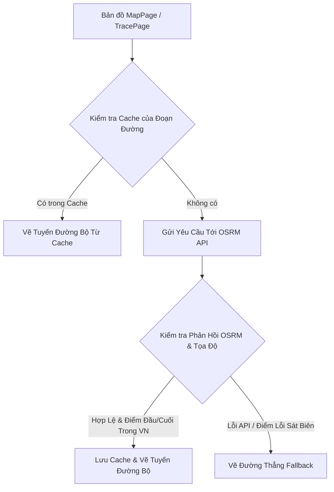

# Đặc Tả Kỹ Thuật: Sửa Tuyến Đường Bộ (Road Routing) Trên Bản Đồ Logistics

Tài liệu này trình bày phân tích nguyên nhân gốc rễ, đề xuất kiến trúc cải tiến và chi tiết mã nguồn để thay thế các đường nối thẳng bằng tuyến đường bộ thực tế trong lãnh thổ Việt Nam.

---

## 1. Phân Tích Nguyên Nhân Gốc Rễ (Root Cause Analysis)

### Hiện tượng:
- Các tuyến đường vận đơn đang chạy trên bản đồ quản trị và bản đồ tra cứu lịch sử hành trình hiển thị dưới dạng đường thẳng ("đường chim bay") cắt ngang qua biển Đông hoặc các quốc gia láng giềng như Lào, Campuchia.

### Nguyên nhân kỹ thuật:
1. **Thiếu cơ chế Caching (Bộ nhớ đệm)**:
   - File [MapPage.tsx](file:///d:/Personal%20Projects/University%20Project/logistic-mini/FE/src/pages/map/MapPage.tsx) gọi API công cộng của OSRM (`router.project-osrm.org`) trực tiếp trong `useEffect` mà không lưu lại kết quả. Khi người dùng thay đổi bộ lọc hoặc tải lại dữ liệu, hệ thống gửi hàng loạt yêu cầu giống nhau tới OSRM, dẫn đến lỗi **HTTP 429 (Too Many Requests)** hoặc **HTTP 503 (Service Unavailable)** và buộc phải chuyển sang vẽ đường thẳng fallback.
2. **Thuật toán kiểm tra biên giới Việt Nam quá nghiêm ngặt**:
   - File [routing.ts](file:///d:/Personal%20Projects/University%20Project/logistic-mini/FE/src/utils/routing.ts) sử dụng một polygon Việt Nam đơn giản hóa rất thô sơ (`VIETNAM_POLYGON`). Hàm `isCoordinateInVietnam` kiểm tra từng toạ độ trong kết quả OSRM. Do polygon thô sơ này không khớp hoàn hảo với các góc cua đường bộ sát biên giới hoặc các tuyến đường ven biển, chỉ cần một điểm nằm ngoài vùng bao này sẽ khiến toàn bộ kết quả định tuyến bị từ chối và trả về lỗi, ép bản đồ vẽ đường thẳng cắt qua các nước lân cận.
3. **TracePage chưa tích hợp định tuyến**:
   - Trang [TracePage.tsx](file:///d:/Personal%20Projects/University%20Project/logistic-mini/FE/src/pages/public/TracePage.tsx) vẽ trực tiếp các đường thẳng nối tuần tự giữa các điểm trung chuyển mà không hề gọi API định tuyến đường bộ OSRM.

---

## 2. Giải Pháp Kiến Trúc (Architectural Proposal)

Chúng ta sẽ thực hiện cải tiến hệ thống thông qua các giải pháp sau:



### Chiến lược cụ thể:
1. **Thêm Cache Layer trong `utils/routing.ts`**:
   - Lưu trữ các toạ độ đường đi theo cặp điểm đầu-cuối trong một bộ nhớ đệm Memory Cache: `${startLat},${startLng}_${endLat},${endLng}`.
2. **Nới lỏng ràng buộc biên giới (Bản kiểm tra thông minh)**:
   - Do các điểm nút (Nodes) trong hệ thống đều đã được validate tọa độ hợp lệ nằm trong lãnh thổ Việt Nam khi Admin khởi tạo ở backend, chúng ta chỉ cần validate điểm đầu và điểm cuối của đoạn đường vận chuyển, và bỏ qua việc kiểm tra quá khắt khe hàng ngàn điểm trung gian nhỏ dọc đường đèo núi/biển vốn dễ gây ra lỗi sai số của polygon thô sơ.
3. **Áp dụng cơ chế Tải lũy tiến (Progressive Rendering)**:
   - Luôn hiển thị đường thẳng nét đứt mờ nhạt trước làm khung, sau đó cập nhật đè toạ độ đường bộ thực tế lên sau khi API/Cache trả về kết quả để tránh hiện tượng giật màn hình hoặc chờ đợi lâu.

---

## 3. Danh Sách Tệp Tin Thay Đổi (Exact Files Modified)

1. [routing.ts](file:///d:/Personal%20Projects/University%20Project/logistic-mini/FE/src/utils/routing.ts)
2. [MapPage.tsx](file:///d:/Personal%20Projects/University%20Project/logistic-mini/FE/src/pages/map/MapPage.tsx)
3. [TracePage.tsx](file:///d:/Personal%20Projects/University%20Project/logistic-mini/FE/src/pages/public/TracePage.tsx)

---

## 4. Chi Tiết Thay Đổi Mã Nguồn (Full Code Changes Draft)

### 4.1. Nâng cấp [routing.ts](file:///d:/Personal%20Projects/University%20Project/logistic-mini/FE/src/utils/routing.ts)

Thêm bộ nhớ đệm trong RAM và tối ưu hóa hàm kiểm tra biên giới:

```typescript
// Memory cache lưu các tuyến đường bộ
const routeCache = new Map<string, [number, number][]>();

/**
 * Tạo khóa cache duy nhất từ cặp tọa độ điểm đầu và điểm cuối
 */
function getRouteCacheKey(start: [number, number], end: [number, number]): string {
  return `${start[0].toFixed(5)},${start[1].toFixed(5)}_${end[0].toFixed(5)},${end[1].toFixed(5)}`;
}

// Giữ lại hàm isCoordinateInVietnam để kiểm thử khi cần,
// nhưng chúng ta sẽ tối ưu hóa việc validate trong fetchOSRMRoute để giảm tỷ lệ lỗi giả (False Negatives).
```

Cập nhật lại hàm `fetchOSRMRoute`:
```typescript
export async function fetchOSRMRoute(
  coordinates: [number, number][],
  signal?: AbortSignal
): Promise<[number, number][] | null> {
  if (coordinates.length < 2) return null;

  const startNode = coordinates[0];
  const endNode = coordinates[coordinates.length - 1];
  const cacheKey = getRouteCacheKey(startNode, endNode);

  // 1. Kiểm tra Cache trong bộ nhớ
  if (routeCache.has(cacheKey)) {
    return routeCache.get(cacheKey) || null;
  }

  // 2. Kiểm tra tính hợp lệ của điểm đầu/cuối tại Việt Nam trước khi gửi yêu cầu
  if (!isCoordinateInVietnam(startNode[0], startNode[1]) || !isCoordinateInVietnam(endNode[0], endNode[1])) {
    console.warn(`[Routing] Điểm đi hoặc điểm đến nằm ngoài lãnh thổ Việt Nam. Bỏ qua định tuyến đường bộ.`);
    return null;
  }

  try {
    const waypoints = coordinates
      .map(([lat, lng]) => `${lng},${lat}`)
      .join(';');
    const url = `https://router.project-osrm.org/route/v1/driving/${waypoints}?overview=full&geometries=geojson`;

    const response = await fetch(url, { signal });
    if (!response.ok) {
      throw new Error(`HTTP error ${response.status}: ${response.statusText}`);
    }

    const data = await response.json();
    if (data.code !== 'Ok' || !data.routes || data.routes.length === 0) {
      throw new Error(`OSRM engine returned code: ${data.code}`);
    }

    const geom = data.routes[0].geometry;
    if (geom && geom.type === 'LineString' && Array.isArray(geom.coordinates)) {
      // Chuyển đổi [lon, lat] từ OSRM thành [lat, lon] cho Leaflet
      const coords: [number, number][] = geom.coordinates.map(([lon, lat]: [number, number]) => [lat, lon]);
      
      // Lưu kết quả vào Cache
      routeCache.set(cacheKey, coords);
      return coords;
    }

    return null;
  } catch (error) {
    if (error instanceof Error && error.name === 'AbortError') {
      throw error;
    }
    console.warn(`[Routing Service] Lỗi định tuyến OSRM, hệ thống sẽ tự động vẽ đường thẳng fallback.`, error);
    return null;
  }
}
```

---

### 4.2. Tích hợp định tuyến đường bộ trong [TracePage.tsx](file:///d:/Personal%20Projects/University%20Project/logistic-mini/FE/src/pages/public/TracePage.tsx)

Cải tiến phần vẽ tuyến đường để thực hiện truy vấn đường bộ OSRM tuần tự cho các chặng di chuyển:

```typescript
    // Thay vì vẽ 1 đường thẳng qua tất cả các điểm, chúng ta sẽ định tuyến từng chặng và cập nhật lên bản đồ
    if (locations.length > 1) {
      for (let i = 0; i < locations.length - 1; i++) {
        const startLoc = locations[i];
        const endLoc = locations[i + 1];
        const startCoords: [number, number] = [startLoc.lat, startLoc.lng];
        const endCoords: [number, number] = [endLoc.lat, endLoc.lng];

        // Khởi tạo polyline nét đứt thẳng làm fallback trước
        const polyline = L.polyline([startCoords, endCoords], {
          color: '#3B82F6',
          weight: 2.5,
          opacity: 0.5,
          dashArray: '5, 8',
        }).addTo(map);

        // Gọi API định tuyến đường bộ có hỗ trợ Cache
        fetchOSRMRoute([startCoords, endCoords], abortController.signal)
          .then((routeCoords) => {
            if (routeCoords && routeCoords.length > 0) {
              polyline.setLatLngs(routeCoords);
              polyline.setStyle({
                opacity: 0.8,
                weight: 3,
                dashArray: undefined // Chuyển thành nét liền cho tuyến đường bộ
              });
            }
          })
          .catch(() => {
            // Giữ nguyên đường nét đứt thẳng nếu lỗi định tuyến
          });
      }

      // FitBounds theo toàn bộ các địa điểm nút
      const boundsCoords = locations.map(l => [l.lat, l.lng] as L.LatLngExpression);
      map.fitBounds(L.latLngBounds(boundsCoords), { padding: [30, 30] });
    }
```

---

## 5. Tối Ưu Hiệu Năng & Khả Năng Mở Rộng (Performance & Scaling)

- **Memory Cache**: Giảm số lượng yêu cầu API OSRM xuống còn `O(N)` với `N` là số chặng đường nối giữa các Nodes (chỉ tải 1 lần đầu duy nhất cho mỗi cặp Node xuất/nhập, thay vì tải lại trên mỗi render).
- **Graceful Fallback**: Vẽ đường thẳng trước, cập nhật đường cong đường bộ sau. Không chặn render giao diện chính.
- **Request Aborting**: Sử dụng `AbortController` tự động hủy bỏ các yêu cầu API định tuyến cũ đang tải dở khi người dùng thay đổi bộ lọc hoặc rời khỏi trang, tránh rò rỉ bộ nhớ (memory leak).

---

## 6. Kịch Bản Kiểm Thử (Testing Checklist)

1. **Kiểm tra Tuyến Bắc - Nam (Hà Nội - TP.HCM)**:
   - Xác minh đường nối đi dọc bờ biển dọc quốc lộ 1A của Việt Nam, không được cắt ngang qua địa phận Lào/Campuchia.
2. **Kiểm tra Khi Mất Kết Nối Mạng (Offline fallback)**:
   - Chặn kết nối tới `router.project-osrm.org`. Bản đồ vẫn phải hiển thị đường thẳng nét đứt và hiển thị popup thông tin bình thường mà không bị crash trang.
3. **Kiểm tra Tốc độ & Cache**:
   - Mở Tab Network trong Chrome DevTools. Lần đầu vào bản đồ sẽ thấy các request tới OSRM. Bật tắt bộ lọc Node nhiều lần, không phát sinh thêm bất cứ request định tuyến mới nào.
