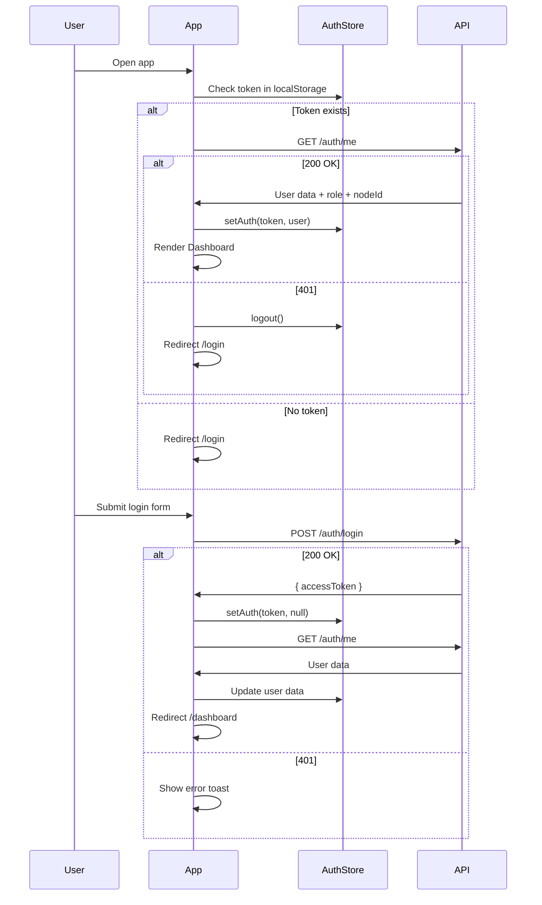

# 🎨 Frontend Architecture – Mini Supply Chain Traceability

## Confirmed Requirements

| Item | Decision |
|------|----------|
| **Framework** | React 18 + Vite (SPA) |
| **Styling** | TailwindCSS v3 |
| **Language** | TypeScript |
| **Dark/Light** | Có hỗ trợ cả hai |
| **i18n** | Song ngữ Việt–Anh |
| **API Base URL** | `http://localhost:3000/api/v1` |
| **UI Reference** | Không có (tự thiết kế) |
| **Seed Accounts** | `admin1@logistic.com` / `admin2@logistic.com` (password123) |

---

## 1. Tech Stack & Dependencies

### Core

| Package | Version | Purpose |
|---------|---------|---------|
| `react` | ^18 | UI Library |
| `react-dom` | ^18 | DOM renderer |
| `vite` | ^5 | Build tool + dev server |
| `typescript` | ^5 | Type safety |
| `tailwindcss` | ^3.4 | Utility-first CSS |
| `react-router-dom` | ^6 | Client-side routing |

### State & Data

| Package | Purpose |
|---------|---------|
| `@tanstack/react-query` | Server state management, caching, polling |
| `zustand` | Client state (auth, theme, language) |
| `axios` | HTTP client + interceptors |

### UI Components & Enhancement

| Package | Purpose |
|---------|---------|
| `@headlessui/react` | Accessible modal, dropdown, dialog, tabs |
| `@heroicons/react` | Icon set (Heroicons v2) |
| `framer-motion` | Page transitions, timeline animation |
| `react-hot-toast` | Toast notifications |
| `recharts` | Dashboard charts (bar, pie, line) |

### Map & QR

| Package | Purpose |
|---------|---------|
| `react-leaflet` + `leaflet` | Map visualization |
| `html5-qrcode` | QR scanning via camera |

### i18n

| Package | Purpose |
|---------|---------|
| `react-i18next` + `i18next` | Internationalization |
| `i18next-browser-languagedetector` | Auto detect browser lang |

### Dev Tools

| Package | Purpose |
|---------|---------|
| `@tanstack/react-query-devtools` | Query debugging |
| `eslint` + `prettier` | Code quality |
| `@types/*` | TypeScript definitions |

---

## 2. Cấu Trúc Thư Mục (Feature-based)

```
FE/
├── public/
│   └── locales/
│       ├── vi/
│       │   └── translation.json
│       └── en/
│           └── translation.json
├── src/
│   ├── main.tsx                    # Entry point
│   ├── App.tsx                     # Root component + Router
│   ├── vite-env.d.ts
│   │
│   ├── api/                        # API service layer
│   │   ├── axios.ts                # Axios instance + interceptors
│   │   ├── auth.api.ts
│   │   ├── users.api.ts
│   │   ├── nodes.api.ts
│   │   ├── products.api.ts
│   │   ├── batches.api.ts
│   │   ├── shipments.api.ts
│   │   ├── incidents.api.ts
│   │   ├── dashboard.api.ts
│   │   ├── audit.api.ts
│   │   ├── reports.api.ts
│   │   └── public.api.ts
│   │
│   ├── hooks/                      # Custom hooks
│   │   ├── useAuth.ts              # Auth state hook
│   │   ├── useTheme.ts             # Dark/Light toggle
│   │   ├── queries/                # TanStack Query hooks
│   │   │   ├── useUsers.ts
│   │   │   ├── useNodes.ts
│   │   │   ├── useProducts.ts
│   │   │   ├── useBatches.ts
│   │   │   ├── useShipments.ts
│   │   │   ├── useIncidents.ts
│   │   │   ├── useDashboard.ts
│   │   │   ├── useAuditLogs.ts
│   │   │   └── usePublicTrace.ts
│   │   └── mutations/              # TanStack mutation hooks
│   │       ├── useLoginMutation.ts
│   │       ├── useCreateUser.ts
│   │       ├── useCreateNode.ts
│   │       ├── useCreateProduct.ts
│   │       ├── useCreateBatch.ts
│   │       ├── useCreateShipment.ts
│   │       ├── useReceiveShipment.ts
│   │       ├── useSellBatch.ts
│   │       ├── useCreateIncident.ts
│   │       └── useConfirmLostFound.ts
│   │
│   ├── stores/                     # Zustand stores
│   │   ├── authStore.ts            # User, token, role, nodeId
│   │   ├── themeStore.ts           # dark/light mode
│   │   └── langStore.ts            # vi/en language
│   │
│   ├── types/                      # TypeScript interfaces
│   │   ├── auth.types.ts
│   │   ├── user.types.ts
│   │   ├── node.types.ts
│   │   ├── product.types.ts
│   │   ├── batch.types.ts
│   │   ├── shipment.types.ts
│   │   ├── incident.types.ts
│   │   ├── dashboard.types.ts
│   │   ├── audit.types.ts
│   │   ├── timeline.types.ts
│   │   └── common.types.ts         # PaginatedResponse, ApiError...
│   │
│   ├── components/                 # Reusable components
│   │   ├── layout/
│   │   │   ├── AppLayout.tsx       # Sidebar + Header + Main
│   │   │   ├── Sidebar.tsx         # Role-based navigation
│   │   │   ├── Header.tsx          # User info, theme toggle, lang switch
│   │   │   └── PublicLayout.tsx    # Layout for public pages
│   │   ├── ui/
│   │   │   ├── DataTable.tsx       # Generic data table + pagination
│   │   │   ├── StatusBadge.tsx     # Color-coded status badges
│   │   │   ├── StatsCard.tsx       # KPI dashboard card
│   │   │   ├── ConfirmDialog.tsx   # Confirmation modal
│   │   │   ├── FormModal.tsx       # Generic form modal wrapper
│   │   │   ├── SearchBar.tsx       # Debounced search input
│   │   │   ├── EmptyState.tsx      # Empty data illustration
│   │   │   ├── LoadingSkeleton.tsx  # Shimmer loading
│   │   │   ├── PageHeader.tsx      # Page title + breadcrumb + actions
│   │   │   ├── AlertBanner.tsx     # Sticky warning/error banner
│   │   │   └── PaginationControl.tsx
│   │   ├── domain/
│   │   │   ├── TimelineStepper.tsx  # Vertical timeline for batch history
│   │   │   ├── MapView.tsx         # Leaflet map with markers/polylines
│   │   │   ├── QRDisplay.tsx       # QR code render + download/print
│   │   │   ├── QRScanner.tsx       # Camera-based QR scanner
│   │   │   └── BatchStatusFlow.tsx # Visual state machine
│   │   └── guards/
│   │       ├── ProtectedRoute.tsx  # Auth guard (redirect if not logged in)
│   │       └── RoleGuard.tsx       # Role-based access control
│   │
│   ├── pages/                      # Page components
│   │   ├── auth/
│   │   │   └── LoginPage.tsx
│   │   ├── dashboard/
│   │   │   └── DashboardPage.tsx
│   │   ├── users/
│   │   │   └── UsersPage.tsx
│   │   ├── nodes/
│   │   │   └── NodesPage.tsx
│   │   ├── products/
│   │   │   └── ProductsPage.tsx
│   │   ├── batches/
│   │   │   ├── BatchesPage.tsx
│   │   │   └── BatchDetailPage.tsx
│   │   ├── shipments/
│   │   │   ├── ShipmentsPage.tsx
│   │   │   └── ShipmentDetailPage.tsx
│   │   ├── incidents/
│   │   │   └── IncidentsPage.tsx
│   │   ├── audit/
│   │   │   └── AuditLogsPage.tsx
│   │   ├── map/
│   │   │   └── MapPage.tsx
│   │   ├── public/
│   │   │   ├── ScanPage.tsx
│   │   │   └── TracePage.tsx
│   │   └── NotFoundPage.tsx
│   │
│   ├── utils/                      # Utility functions
│   │   ├── constants.ts            # API_BASE_URL, role enums, status enums
│   │   ├── formatters.ts           # Date, number, currency formatters
│   │   ├── validators.ts           # Form validation helpers
│   │   └── rolePermissions.ts      # Role → allowed routes/actions mapping
│   │
│   ├── i18n/
│   │   └── index.ts                # i18next configuration
│   │
│   └── styles/
│       └── index.css               # TailwindCSS directives + custom styles
│
├── index.html
├── tailwind.config.js
├── postcss.config.js
├── tsconfig.json
├── tsconfig.node.json
├── vite.config.ts
├── .env
├── .env.example
└── package.json
```

---

## 3. Routing Architecture

### Route Map

```typescript
// App.tsx - React Router v6
<Routes>
  {/* Public Routes - No auth required */}
  <Route element={<PublicLayout />}>
    <Route path="/login" element={<LoginPage />} />
    <Route path="/scan" element={<ScanPage />} />
    <Route path="/trace/:batchCode" element={<TracePage />} />
  </Route>

  {/* Protected Routes - Auth required */}
  <Route element={<ProtectedRoute />}>
    <Route element={<AppLayout />}>
      {/* All authenticated users */}
      <Route path="/" element={<Navigate to="/dashboard" />} />
      <Route path="/dashboard" element={<DashboardPage />} />
      <Route path="/batches" element={<BatchesPage />} />
      <Route path="/batches/:id" element={<BatchDetailPage />} />
      <Route path="/shipments" element={<ShipmentsPage />} />
      <Route path="/shipments/:id" element={<ShipmentDetailPage />} />
      <Route path="/products" element={<ProductsPage />} />

      {/* Admin only */}
      <Route element={<RoleGuard allowed={['Admin']} />}>
        <Route path="/users" element={<UsersPage />} />
        <Route path="/nodes" element={<NodesPage />} />
        <Route path="/incidents" element={<IncidentsPage />} />
        <Route path="/audit-logs" element={<AuditLogsPage />} />
        <Route path="/map" element={<MapPage />} />
      </Route>
    </Route>
  </Route>

  <Route path="*" element={<NotFoundPage />} />
</Routes>
```

### Route Permissions Summary

| Route | Admin | Manufacturer | Distributor | Retailer | Public |
|-------|:-----:|:------------:|:-----------:|:--------:|:------:|
| `/login` | — | — | — | — | ✅ |
| `/scan` | — | — | — | — | ✅ |
| `/trace/:code` | — | — | — | — | ✅ |
| `/dashboard` | ✅ | ✅ | ✅ | ✅ | — |
| `/batches` | ✅ | ✅ | ✅ | ✅ | — |
| `/batches/:id` | ✅ | ✅ | ✅ | ✅ | — |
| `/shipments` | ✅ | ✅ | ✅ | ✅ | — |
| `/products` | ✅ | ✅ | ✅ | ✅ | — |
| `/users` | ✅ | — | — | — | — |
| `/nodes` | ✅ | — | — | — | — |
| `/incidents` | ✅ | — | — | — | — |
| `/audit-logs` | ✅ | — | — | — | — |
| `/map` | ✅ | — | — | — | — |

---

## 4. State Management Architecture

### Zustand Stores (Client State)

```typescript
// authStore.ts
interface AuthState {
  token: string | null;
  user: User | null;
  role: string | null;
  nodeId: string | null;
  isAuthenticated: boolean;
  setAuth: (token: string, user: User) => void;
  logout: () => void;
}

// themeStore.ts
interface ThemeState {
  isDark: boolean;
  toggleTheme: () => void;
}

// langStore.ts
interface LangState {
  language: 'vi' | 'en';
  setLanguage: (lang: 'vi' | 'en') => void;
}
```

### TanStack Query (Server State)

```typescript
// Query Keys Convention
const queryKeys = {
  users:     ['users'],
  nodes:     ['nodes'],
  products:  ['products'],
  batches:   ['batches'],
  shipments: ['shipments'],
  incidents: ['incidents'],
  dashboard: ['dashboard', 'stats'],
  auditLogs: ['audit-logs'],
  batchDetail: (id: string) => ['batches', id],
  batchTimeline: (id: string) => ['batches', id, 'timeline'],
  shipmentDetail: (id: string) => ['shipments', id],
  publicTrace: (code: string) => ['public', 'trace', code],
};
```

---

## 5. API Service Layer

### Axios Instance

```typescript
// api/axios.ts
const api = axios.create({
  baseURL: 'http://localhost:3000/api/v1',
  timeout: 15000,
  headers: { 'Content-Type': 'application/json' },
});

// Request Interceptor: Attach JWT
api.interceptors.request.use((config) => {
  const token = useAuthStore.getState().token;
  if (token) {
    config.headers.Authorization = `Bearer ${token}`;
  }
  return config;
});

// Response Interceptor: Handle 401
api.interceptors.response.use(
  (response) => response,
  (error) => {
    if (error.response?.status === 401) {
      useAuthStore.getState().logout();
      window.location.href = '/login';
      toast.error(t('auth.sessionExpired'));
    }
    return Promise.reject(error);
  }
);
```

### API Service Pattern (Example)

```typescript
// api/batches.api.ts
export const batchesApi = {
  getList: (params: PaginationParams) =>
    api.get<PaginatedResponse<Batch>>('/batches', { params }),

  getDetail: (id: string) =>
    api.get<BatchDetail>(`/batches/${id}`),

  getTimeline: (id: string) =>
    api.get<TimelineEvent[]>(`/batches/${id}/timeline`),

  create: (data: CreateBatchDto) =>
    api.post<Batch>('/batches', data),

  sell: (id: string, data: { quantity: number }) =>
    api.post(`/batches/${id}/sell`, data),

  regenerateQR: (id: string) =>
    api.post<QRCode>(`/batches/${id}/regenerate-qr`),
};
```

---

## 6. Design System

### Color Palette

```javascript
// tailwind.config.js
module.exports = {
  darkMode: 'class',   // Dark mode via class strategy
  content: ['./index.html', './src/**/*.{js,ts,jsx,tsx}'],
  theme: {
    extend: {
      fontFamily: {
        sans: ['Inter', 'system-ui', 'sans-serif'],
      },
      colors: {
        // Brand colors
        primary: {
          50:  '#eff6ff',
          100: '#dbeafe',
          200: '#bfdbfe',
          300: '#93c5fd',
          400: '#60a5fa',
          500: '#3b82f6',  // Main primary
          600: '#2563eb',
          700: '#1d4ed8',
          800: '#1e40af',
          900: '#1e3a8a',
        },
        // Status colors for supply chain
        status: {
          created:       '#8b5cf6', // violet
          inTransit:     '#f59e0b', // amber
          received:      '#10b981', // emerald
          sold:          '#6366f1', // indigo
          delayed:       '#f97316', // orange
          investigating: '#ef4444', // red
          lost:          '#dc2626', // red-600
          discarded:     '#6b7280', // gray
        },
        // Node type colors (for map markers)
        node: {
          manufacturer: '#22c55e', // green
          distributor:  '#f59e0b', // amber
          retailer:     '#ef4444', // red
          warehouse:    '#6366f1', // indigo
        },
        // Priority colors
        priority: {
          low:      '#6b7280',
          medium:   '#f59e0b',
          high:     '#f97316',
          critical: '#ef4444',
        },
        // Dark mode surface colors
        surface: {
          light: '#ffffff',
          dark:  '#1e1e2e',
        },
        sidebar: {
          light: '#f8fafc',
          dark:  '#181825',
        },
      },
      animation: {
        'pulse-slow': 'pulse 3s cubic-bezier(0.4, 0, 0.6, 1) infinite',
        'slide-in': 'slideIn 0.3s ease-out',
        'fade-in': 'fadeIn 0.2s ease-out',
      },
    },
  },
  plugins: [
    require('@tailwindcss/forms'),
  ],
};
```

### Typography Scale

| Element | Font | Size | Weight | Usage |
|---------|------|------|--------|-------|
| H1 | Inter | 30px (text-3xl) | Bold (700) | Page titles |
| H2 | Inter | 24px (text-2xl) | Semibold (600) | Section headers |
| H3 | Inter | 20px (text-xl) | Semibold (600) | Card titles |
| Body | Inter | 14px (text-sm) | Normal (400) | Default text |
| Caption | Inter | 12px (text-xs) | Normal (400) | Labels, hints |
| Code | JetBrains Mono | 13px | Normal | Batch codes, tracking |

### Component Design Tokens

```
┌─ Cards ─────────────────────────────────┐
│ Border Radius: rounded-xl (12px)        │
│ Shadow: shadow-sm hover:shadow-md       │
│ Padding: p-6                            │
│ Dark BG: bg-gray-800/50                 │
│ Light BG: bg-white                      │
│ Border: border border-gray-200/60       │
│         dark:border-gray-700/50         │
└─────────────────────────────────────────┘

┌─ Buttons ───────────────────────────────┐
│ Primary: bg-primary-600 hover:bg-primary-700 │
│ Secondary: bg-gray-100 dark:bg-gray-700 │
│ Danger: bg-red-600 hover:bg-red-700     │
│ Sizes: px-4 py-2 text-sm rounded-lg    │
│ Transition: transition-all duration-200 │
└─────────────────────────────────────────┘

┌─ Inputs ────────────────────────────────┐
│ Border: border-gray-300 dark:border-gray-600 │
│ Focus: ring-2 ring-primary-500          │
│ BG: bg-white dark:bg-gray-800           │
│ Radius: rounded-lg                      │
│ Padding: px-4 py-2.5                    │
└─────────────────────────────────────────┘

┌─ StatusBadge ───────────────────────────┐
│ CREATED:       bg-violet-100 text-violet-800  │
│ IN_TRANSIT:    bg-amber-100 text-amber-800    │
│ RECEIVED:      bg-emerald-100 text-emerald-800│
│ SOLD:          bg-indigo-100 text-indigo-800  │
│ DELAYED:       bg-orange-100 text-orange-800  │
│ INVESTIGATING: bg-red-100 text-red-800        │
│ LOST:          bg-red-200 text-red-900        │
│ Shape: px-2.5 py-0.5 rounded-full text-xs    │
│        font-semibold                          │
└─────────────────────────────────────────┘
```

---

## 7. Layout Architecture

### AppLayout (Internal Pages)

```
┌──────────────────────────────────────────────────┐
│  Header (h-16)                                    │
│  ┌─────┬────────────────────────────────────────┐│
│  │Logo │ Search  │  🌙/☀️  │ 🌐 Vi/En │ 👤 User││
│  └─────┴────────────────────────────────────────┘│
├───────────┬──────────────────────────────────────┤
│ Sidebar   │  Main Content Area                    │
│ (w-64)    │  ┌──────────────────────────────────┐│
│           │  │ PageHeader (Title + Breadcrumb)  ││
│ Dashboard │  ├──────────────────────────────────┤│
│ Batches   │  │                                  ││
│ Shipments │  │    Page Content                  ││
│ Products  │  │    (scrollable)                  ││
│ ───Admin──│  │                                  ││
│ Users     │  │                                  ││
│ Nodes     │  │                                  ││
│ Incidents │  │                                  ││
│ Audit     │  │                                  ││
│ Map       │  │                                  ││
│           │  └──────────────────────────────────┘│
│ ──────────│                                      │
│ Collapse  │                                      │
│ Logout    │                                      │
└───────────┴──────────────────────────────────────┘
```

### Sidebar Navigation Items

```typescript
const navItems = [
  // All roles
  { icon: HomeIcon, label: 'sidebar.dashboard', path: '/dashboard', roles: '*' },
  { icon: CubeIcon, label: 'sidebar.batches', path: '/batches', roles: '*' },
  { icon: TruckIcon, label: 'sidebar.shipments', path: '/shipments', roles: '*' },
  { icon: TagIcon, label: 'sidebar.products', path: '/products', roles: '*' },

  // Divider: Admin Section
  { type: 'divider', label: 'sidebar.administration', roles: ['Admin'] },
  { icon: UsersIcon, label: 'sidebar.users', path: '/users', roles: ['Admin'] },
  { icon: MapPinIcon, label: 'sidebar.nodes', path: '/nodes', roles: ['Admin'] },
  { icon: ExclamationTriangleIcon, label: 'sidebar.incidents', path: '/incidents', roles: ['Admin'] },
  { icon: ClipboardDocumentListIcon, label: 'sidebar.auditLogs', path: '/audit-logs', roles: ['Admin'] },
  { icon: MapIcon, label: 'sidebar.map', path: '/map', roles: ['Admin'] },
];
```

### PublicLayout (Scan + Trace Pages)

```
┌──────────────────────────────────────────────────┐
│  Minimal Header                                   │
│  ┌──────────────────────────────────────────────┐│
│  │ 📦 Mini Logistic     │  🌐 Vi/En  │  Login  ││
│  └──────────────────────────────────────────────┘│
├──────────────────────────────────────────────────┤
│                                                   │
│         Full-width Content Area                   │
│         (Mobile-first responsive)                 │
│                                                   │
└──────────────────────────────────────────────────┘
```

---

## 8. i18n Structure

### Configuration

```typescript
// i18n/index.ts
import i18n from 'i18next';
import { initReactI18next } from 'react-i18next';
import LanguageDetector from 'i18next-browser-languagedetector';
import vi from '../locales/vi/translation.json';
import en from '../locales/en/translation.json';

i18n
  .use(LanguageDetector)
  .use(initReactI18next)
  .init({
    resources: { vi: { translation: vi }, en: { translation: en } },
    fallbackLng: 'vi',
    interpolation: { escapeValue: false },
  });
```

### Translation Keys Structure (Sample)

```json
{
  "common": {
    "save": "Lưu",
    "cancel": "Hủy",
    "delete": "Xóa",
    "edit": "Chỉnh sửa",
    "create": "Tạo mới",
    "search": "Tìm kiếm...",
    "loading": "Đang tải...",
    "noData": "Không có dữ liệu",
    "confirm": "Xác nhận",
    "actions": "Thao tác"
  },
  "auth": {
    "login": "Đăng nhập",
    "logout": "Đăng xuất",
    "email": "Email",
    "password": "Mật khẩu",
    "sessionExpired": "Phiên đăng nhập đã hết hạn"
  },
  "sidebar": {
    "dashboard": "Tổng quan",
    "batches": "Lô hàng",
    "shipments": "Vận đơn",
    "products": "Sản phẩm",
    "users": "Nhân sự",
    "nodes": "Mạng lưới",
    "incidents": "Sự cố",
    "auditLogs": "Nhật ký",
    "map": "Bản đồ",
    "administration": "Quản trị"
  },
  "dashboard": {
    "totalInventory": "Tổng tồn kho",
    "activeShipments": "Vận đơn hoạt động",
    "openIncidents": "Sự cố đang mở"
  },
  "batch": {
    "status": {
      "CREATED": "Khởi tạo",
      "IN_TRANSIT": "Đang vận chuyển",
      "RECEIVED": "Đã nhận",
      "SOLD": "Đã bán",
      "DELAYED": "Trễ hạn",
      "INVESTIGATING": "Đang điều tra",
      "LOST": "Thất lạc",
      "DISCARDED": "Đã loại bỏ"
    }
  }
}
```

---

## 9. Dark Mode Implementation

### Strategy: TailwindCSS `class` mode

```typescript
// stores/themeStore.ts
export const useThemeStore = create<ThemeState>()(
  persist(
    (set) => ({
      isDark: false,
      toggleTheme: () => set((state) => {
        const newDark = !state.isDark;
        document.documentElement.classList.toggle('dark', newDark);
        return { isDark: newDark };
      }),
    }),
    { name: 'theme-storage' }
  )
);
```

### CSS Pattern

```html
<!-- Every component uses dark: prefix -->
<div class="bg-white dark:bg-gray-900 text-gray-900 dark:text-gray-100">
  <div class="border border-gray-200 dark:border-gray-700">
    <h2 class="text-gray-800 dark:text-gray-200">Title</h2>
    <p class="text-gray-600 dark:text-gray-400">Description</p>
  </div>
</div>
```

---

## 10. Authentication Flow



---

## 11. Error Handling Strategy

### HTTP Error → UI Mapping

| Status | Frontend Action |
|--------|----------------|
| `400` | Toast error + show field errors from response.message |
| `401` | Auto logout + redirect `/login` + toast "Phiên hết hạn" |
| `403` | Toast "Bạn không có quyền" + disable action |
| `404` | Navigate to 404 page or toast "Không tìm thấy" |
| `409` | **Optimistic lock conflict** → Dialog "Dữ liệu đã thay đổi, tải lại?" |
| `422` | Validation error → show inline field errors |
| `500` | Toast "Lỗi hệ thống" + retry button |
| Network | Toast "Mất kết nối mạng" + offline indicator |

### TanStack Query Error Handling

```typescript
const queryClient = new QueryClient({
  defaultOptions: {
    queries: {
      retry: 1,
      staleTime: 30_000,
      refetchOnWindowFocus: false,
      onError: (error: AxiosError) => {
        if (error.response?.status !== 401) {
          toast.error(extractErrorMessage(error));
        }
      },
    },
    mutations: {
      onError: (error: AxiosError) => {
        toast.error(extractErrorMessage(error));
      },
    },
  },
});
```

---

## 12. Key Page Wireframes

### Dashboard Page

```
┌─────────────────────────────────────────────────────┐
│ 📊 Tổng Quan Hệ Thống                    [Refresh] │
├─────────────┬──────────────┬──────────────┬─────────┤
│ 📦 1,500    │ 🚚 2         │ ⚠️ 1         │ 💰 50   │
│ Tổng tồn kho│ Vận đơn đang │ Sự cố đang   │ Đã bán  │
│             │ chuyển       │ mở           │ hôm nay │
├─────────────┴──────────────┴──────────────┴─────────┤
│                                                      │
│  ┌─────────────────────┐  ┌──────────────────────┐  │
│  │ 📊 Biểu đồ tồn kho  │  │ 🗺️ Mini Map          │  │
│  │ (Recharts Bar Chart)│  │ (Leaflet Preview)    │  │
│  │                     │  │                      │  │
│  └─────────────────────┘  └──────────────────────┘  │
│                                                      │
│  ┌──────────────────────────────────────────────────┐│
│  │ 🚚 Vận Đơn Đang Hoạt Động                       ││
│  │ ┌────┬─────────┬────────┬─────────┬────────────┐ ││
│  │ │ #  │ Tracking│ Batch  │ Status  │ Action     │ ││
│  │ ├────┼─────────┼────────┼─────────┼────────────┤ ││
│  │ │ 1  │ SHP-... │ BCH-...│ 🟡 TRANS│ [Nhận hàng]│ ││
│  │ └────┴─────────┴────────┴─────────┴────────────┘ ││
│  └──────────────────────────────────────────────────┘│
└──────────────────────────────────────────────────────┘
```

### Public Trace Page (WOW Factor)

```
┌──────────────────────────────────────┐
│  📦 Truy Xuất Nguồn Gốc Sản Phẩm   │
│                                       │
│  ┌───────────────────────────────┐   │
│  │ Product: Vắc-xin Influenza   │   │
│  │ Batch:   BCH-20260524-100A   │   │
│  │ Status:  🟢 RECEIVED          │   │
│  │ Origin:  Nhà máy Sản xuất A  │   │
│  └───────────────────────────────┘   │
│                                       │
│  ── Timeline ──                       │
│                                       │
│  🟣 ● CREATED                        │
│  │   Nhà máy Sản xuất A              │
│  │   24/05/2026 08:00                │
│  │   ↓ 2 giờ                         │
│  🟡 ● SHIPPED                        │
│  │   Xuất kho 600 hộp                │
│  │   24/05/2026 10:00                │
│  │   ↓ 4.5 giờ                       │
│  🟢 ● RECEIVED                       │
│  │   Kho Phân Phối Miền Bắc         │
│  │   24/05/2026 14:30                │
│  │   ↓ 1 giờ                         │
│  🟡 ● SHIPPED                        │
│  │   Giao 400 hộp                    │
│  │   24/05/2026 15:30                │
│  │   ↓ 3 giờ                         │
│  🟢 ● RECEIVED                       │
│  │   Nhà Thuốc Retailer C           │
│  │   24/05/2026 18:30                │
│  │   ↓ 30 phút                       │
│  🔵 ● SOLD                           │
│  │   Bán lẻ 50 sản phẩm             │
│  │   24/05/2026 19:00                │
│                                       │
│  ── Bản Đồ Hành Trình ──             │
│  ┌───────────────────────────────┐   │
│  │         🗺️ Leaflet Map        │   │
│  │    🟢 Hà Nội ───→ 🟡 HP      │   │
│  │                  ───→ 🔴 HN   │   │
│  └───────────────────────────────┘   │
└──────────────────────────────────────┘
```

---

## 13. Third-Party Library Integration

### Leaflet Map (MapView Component)

- Markers với icon color theo `nodeType` (manufacturer=green, distributor=amber, retailer=red)
- Popup trên marker: tên node, type, address, tồn kho tổng
- Dashed Polyline nối `sourceNode → destNode` cho shipments IN_TRANSIT
- Popup trên polyline: tracking code, batch, quantity, elapsed time
- Zoom to fit all markers

### html5-qrcode (QRScanner Component)

- Camera permission request
- Viewfinder với khung guide hình vuông
- Decode URL → extract batch code → navigate to `/trace/:batchCode`
- Fallback: manual batch code input field

### Recharts (Dashboard Charts)

- **Bar Chart**: Tồn kho theo node
- **Donut Chart**: Batch status distribution
- Responsive, dark mode aware colors

### Framer Motion (Animations)

- Page transitions: `fadeIn` + `slideUp`
- Timeline stepper: `stagger` animation cho mỗi event card
- Status badge: subtle `pulse` for INVESTIGATING
- Sidebar collapse: smooth `width` transition

---

## 14. Development Phases

| Phase | Duration | Modules | Deliverables |
|-------|----------|---------|-------------- |
| **Phase 1** | 2-3 days | Vite setup, TailwindCSS, routing, auth store, API layer, i18n, dark mode, Layout | Login + AppLayout + Sidebar + Header |
| **Phase 2** | 2 days | Dashboard + StatsCard + mini MapView | Dashboard page with KPI cards + chart |
| **Phase 3** | 2 days | Nodes CRUD + Products CRUD | DataTable + FormModal + StatusBadge |
| **Phase 4** | 1 day | Users CRUD | Users page with role/node filter |
| **Phase 5** | 3 days | Batches list + detail + QR + timeline | BatchesPage + BatchDetailPage + QRDisplay + TimelineStepper |
| **Phase 6** | 2 days | Shipments list + detail + create + receive | ShipmentsPage + ShipmentDetailPage |
| **Phase 7** | 2 days | Incidents + Audit Logs | IncidentsPage + AuditLogsPage |
| **Phase 8** | 2 days | Public Scan + Trace + Map fullscreen | ScanPage + TracePage + MapPage |
| **Phase 9** | 1-2 days | Reports export, responsive polish, edge cases | Export dialog + mobile responsive |

**Total estimated: ~17-19 days**

---

## Open Questions

> [!NOTE]
> Kiến trúc đã sẵn sàng. Khi bạn xác nhận, tôi sẽ bắt tay vào **Phase 1**: khởi tạo dự án Vite + cấu hình TailwindCSS v3 + TypeScript + routing + auth + layout + i18n + dark mode.

> [!IMPORTANT]
> Bạn có muốn tôi bắt đầu code **Phase 1** ngay không?
