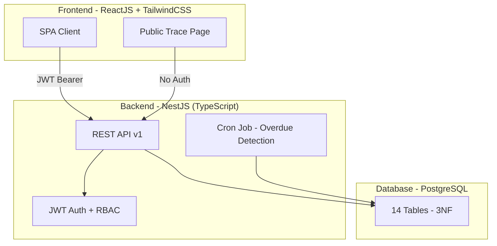
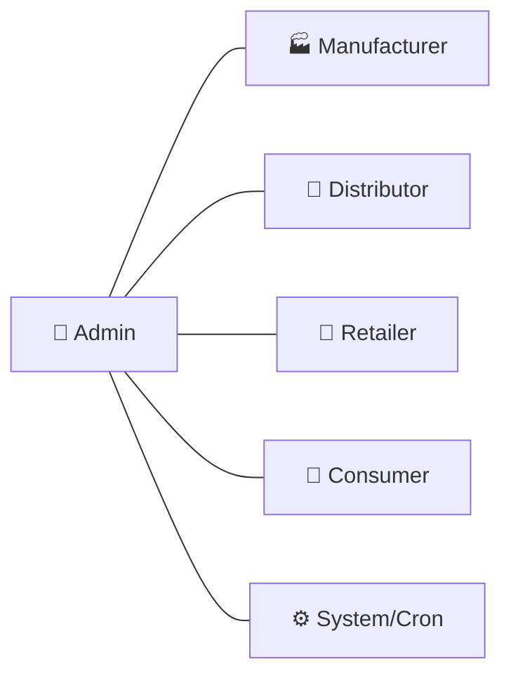
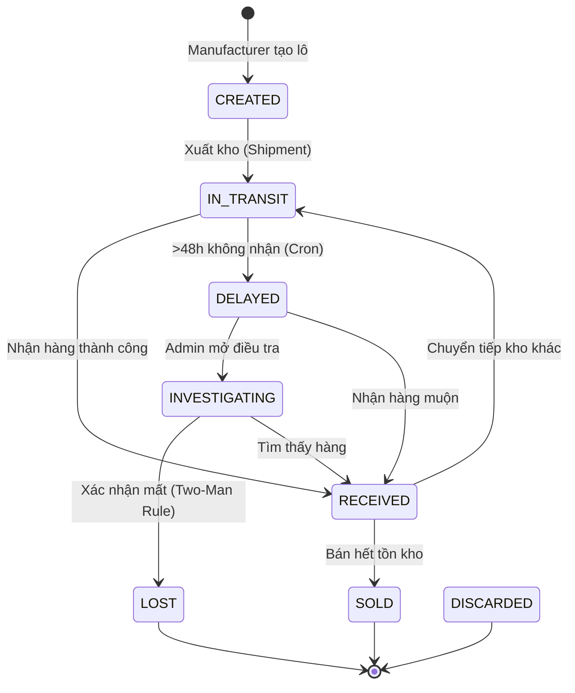
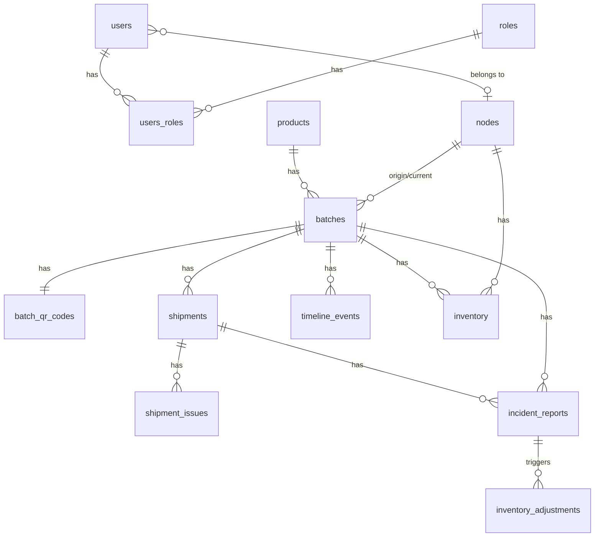
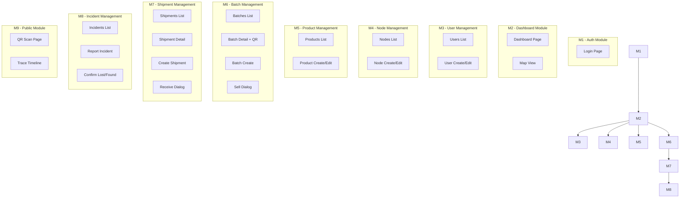
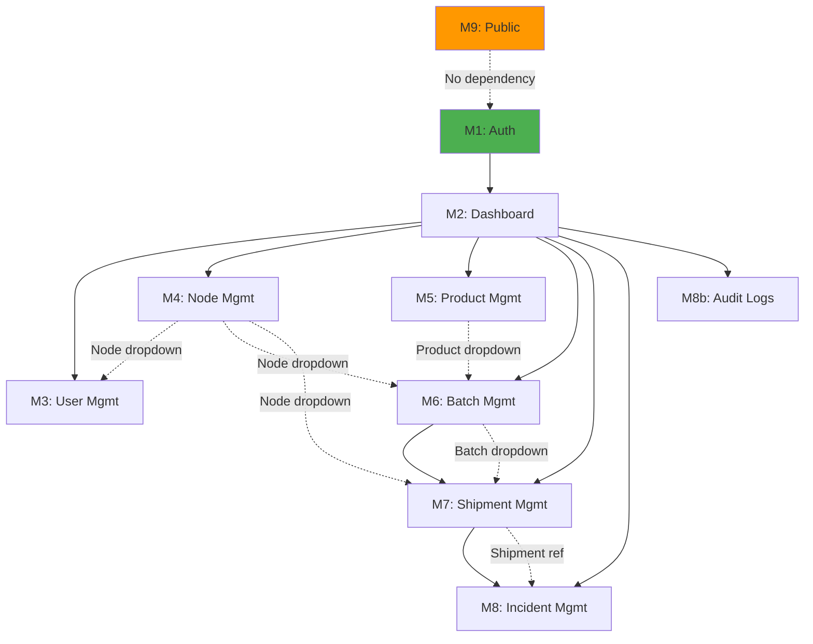

# 🏗️ Phân Tích Kiến Trúc Hệ Thống – Mini Supply Chain Traceability

## Tổng Quan Hệ Thống (Tech Lead Summary)

Hệ thống **Mini Supply Chain Traceability** là một ứng dụng web quản lý chuỗi cung ứng cho phép **số hóa**, **giám sát** và **truy xuất nguồn gốc** các lô hàng hóa theo thời gian thực, từ khâu sản xuất → phân phối → bán lẻ → đến tay người tiêu dùng.

### Kiến trúc tổng quan



### Tech Stack

| Layer | Technology |
|-------|-----------|
| **Backend** | NestJS (TypeScript), Express, TypeORM |
| **Frontend** | ReactJS, TailwindCSS |
| **Database** | PostgreSQL (3NF, ACID, UUID PKs) |
| **Auth** | JWT (HS256, 24h expiry), Bcrypt (saltRounds=12) |
| **QR** | qrcode library (SVG + PNG base64) |
| **Map** | Leaflet + OpenStreetMap |
| **State Mgmt** | TanStack Query (proposed) |

---

## 1. Vai Trò Người Dùng (User Roles)



| # | Role | Mô tả | Node gắn | Scope dữ liệu |
|---|------|--------|-----------|----------------|
| 1 | **Admin** | Quản trị toàn hệ thống, cấu hình master data, xử lý sự cố | `null` | **Toàn bộ** |
| 2 | **Manufacturer** | Nhân viên nhà máy sản xuất, tạo lô hàng, xuất kho | `MANUFACTURER` node | Own node only |
| 3 | **Distributor** | Nhân viên kho phân phối, nhận/chuyển tiếp hàng | `DISTRIBUTOR` node | Own node only |
| 4 | **Retailer** | Nhân viên bán lẻ, nhận hàng + bán lẻ | `RETAILER` node | Own node only |
| 5 | **Consumer** | Khách hàng, quét QR xem truy xuất | N/A | Public trace only |
| 6 | **System/Cron** | Tự động phát hiện vận đơn trễ hạn | N/A | Toàn bộ shipments |

---

## 2. Business Flow – Vòng Đời Lô Hàng

### State Machine (Batch Lifecycle)



### Luồng Happy Path

```
Manufacturer → Tạo Batch (CREATED)
    → Xuất kho → Shipment (IN_TRANSIT)
        → Distributor nhận hàng (RECEIVED)
            → Distributor xuất tiếp → Shipment (IN_TRANSIT)
                → Retailer nhận hàng (RECEIVED)
                    → Retailer bán lẻ (SOLD)
                        → Consumer quét QR (Trace Timeline)
```

### Luồng Exception (Sự cố)

```
Shipment IN_TRANSIT > 48h
    → Cron tự động: DELAYED + ShipmentIssue OVERDUE
        → Admin mở Investigation: INVESTIGATING
            → Admin2 Confirm Lost (Two-Man Rule): LOST + Rollback kho
            → Hoặc Confirm Found: RECEIVED + nhập kho đích
```

---

## 3. Database Schema – 14 Entities

### Phân nhóm ERD

| Nhóm | Bảng | Mục đích |
|------|------|----------|
| **Core Identity** | `users`, `roles`, `users_roles` | Xác thực & phân quyền |
| **Core Supply Chain** | `nodes`, `products`, `batches`, `batch_qr_codes`, `shipments`, `inventory` | Vòng đời hàng hóa |
| **Audit Immutable** | `timeline_events`, `audit_logs`, `scan_logs` | Dữ liệu bất biến |
| **Incident Management** | `incident_reports`, `shipment_issues`, `inventory_adjustments` | Quản lý sự cố |

### Quan hệ chính



---

## 4. API Mapping – 35+ Endpoints Đã Hoàn Thiện

### Bảng tổng hợp API

| # | Module | Endpoint | Method | Quyền | Status BE |
|---|--------|----------|--------|-------|-----------|
| **AUTH** | | | | | |
| 1 | Auth | `/api/v1/auth/login` | POST | Public | ✅ Done |
| 2 | Auth | `/api/v1/auth/me` | GET | All Auth | ✅ Done |
| 3 | Auth | `/api/v1/auth/logout` | POST | All Auth | ✅ Done |
| **USERS** | | | | | |
| 4 | Users | `/api/v1/users` | POST | Admin | ✅ Done |
| 5 | Users | `/api/v1/users` | GET | Admin | ✅ Done |
| 6 | Users | `/api/v1/users/:id` | PUT | Admin | ✅ Done |
| 7 | Users | `/api/v1/users/:id/toggle-active` | PATCH | Admin | ✅ Done |
| 8 | Users | `/api/v1/users/:id/reset-password` | POST | Admin | ✅ Done |
| **NODES** | | | | | |
| 9 | Nodes | `/api/v1/nodes` | POST | Admin | ✅ Done |
| 10 | Nodes | `/api/v1/nodes` | GET | Admin/Mfr/Dist/Ret | ✅ Done |
| 11 | Nodes | `/api/v1/nodes/:id` | PUT | Admin | ✅ Done |
| 12 | Nodes | `/api/v1/nodes/:id` | DELETE | Admin | ✅ Done |
| **PRODUCTS** | | | | | |
| 13 | Products | `/api/v1/products` | POST | Admin | ✅ Done |
| 14 | Products | `/api/v1/products` | GET | All Auth | ✅ Done |
| 15 | Products | `/api/v1/products/:id` | GET | All Auth | ✅ Done |
| 16 | Products | `/api/v1/products/:id` | PUT | Admin | ✅ Done |
| 17 | Products | `/api/v1/products/:id` | DELETE | Admin | ✅ Done |
| **BATCHES** | | | | | |
| 18 | Batches | `/api/v1/batches` | POST | Mfr/Admin | ✅ Done |
| 19 | Batches | `/api/v1/batches` | GET | Admin/Mfr/Dist/Ret (RLS) | ✅ Done |
| 20 | Batches | `/api/v1/batches/:id` | GET | Admin/Mfr/Dist/Ret (RLS) | ✅ Done |
| 21 | Batches | `/api/v1/batches/:id/timeline` | GET | Admin/Mfr/Dist/Ret | ✅ Done |
| 22 | Batches | `/api/v1/batches/:id/sell` | POST | Retailer/Admin | ✅ Done |
| 23 | Batches | `/api/v1/batches/:id/regenerate-qr` | POST | Mfr/Admin | ✅ Done |
| **SHIPMENTS** | | | | | |
| 24 | Shipments | `/api/v1/shipments` | POST | Admin/Mfr/Dist | ✅ Done |
| 25 | Shipments | `/api/v1/shipments` | GET | Admin/Mfr/Dist/Ret (RLS) | ✅ Done |
| 26 | Shipments | `/api/v1/shipments/:id` | GET | Admin/Mfr/Dist/Ret (RLS) | ✅ Done |
| 27 | Shipments | `/api/v1/shipments/:id/receive` | PATCH | Admin/Dist/Ret | ✅ Done |
| **INCIDENTS** | | | | | |
| 28 | Incidents | `/api/v1/incidents` | POST | Admin | ✅ Done |
| 29 | Incidents | `/api/v1/incidents` | GET | Admin | ✅ Done |
| 30 | Incidents | `/api/v1/incidents/:id/confirm-lost` | POST | Admin (Two-Man) | ✅ Done |
| 31 | Incidents | `/api/v1/incidents/:id/confirm-found` | POST | Admin | ✅ Done |
| **PUBLIC** | | | | | |
| 32 | Trace | `/api/v1/public/trace/:batchCode` | GET | Public | ✅ Done |
| **DASHBOARD** | | | | | |
| 33 | Dashboard | `/api/v1/dashboard/stats` | GET | All Auth (RLS) | ✅ Done |
| **AUDIT** | | | | | |
| 34 | Audit | `/api/v1/audit-logs` | GET | Admin | ✅ Done |
| **REPORTS** | | | | | |
| 35 | Reports | `/api/v1/reports/export` | POST | Admin/Mfr | ✅ Done |

> [!IMPORTANT]
> **Toàn bộ 35 API endpoints đã được backend triển khai hoàn thiện.** Frontend cần gọi tất cả các API này. Không cần phát triển thêm API mới.

---

## 5. Các Module Frontend Cần Xây Dựng

### Module Map



---

## 6. Pages Cần Xây Dựng & API Tương Ứng

### 6.1. Login Page (Public)
| API | Mục đích |
|-----|----------|
| `POST /auth/login` | Xác thực + lấy JWT |
| `GET /auth/me` | Lấy thông tin user + role sau login |

### 6.2. Dashboard Page (All Authenticated)
| API | Mục đích |
|-----|----------|
| `GET /dashboard/stats` | KPI cards (totalInventory, activeShipments, incidents) |
| `GET /nodes?includeInventory=true` | Hiển thị bản đồ nodes + tồn kho |
| `GET /shipments?status=IN_TRANSIT` | Active shipments table |

### 6.3. Map View Page (Admin)
| API | Mục đích |
|-----|----------|
| `GET /nodes?includeInventory=true` | Markers trên map |
| `GET /shipments?status=IN_TRANSIT` | Polyline routes |

### 6.4. Users Management Page (Admin)
| API | Mục đích |
|-----|----------|
| `GET /users` | Danh sách users + phân trang + filter |
| `POST /users` | Tạo user mới |
| `PUT /users/:id` | Chỉnh sửa user |
| `PATCH /users/:id/toggle-active` | Kích hoạt/vô hiệu hóa |
| `POST /users/:id/reset-password` | Cấp lại mật khẩu |

### 6.5. Nodes Management Page (Admin)
| API | Mục đích |
|-----|----------|
| `GET /nodes` | Danh sách nodes |
| `POST /nodes` | Tạo node mới |
| `PUT /nodes/:id` | Chỉnh sửa (có optimistic locking) |
| `DELETE /nodes/:id` | Vô hiệu hóa (soft delete) |

### 6.6. Products Management Page (Admin, view: All)
| API | Mục đích |
|-----|----------|
| `GET /products` | Danh sách sản phẩm + search + filter |
| `GET /products/:id` | Chi tiết sản phẩm |
| `POST /products` | Tạo sản phẩm |
| `PUT /products/:id` | Chỉnh sửa sản phẩm |
| `DELETE /products/:id` | Xóa mềm |

### 6.7. Batches List Page (Admin/Mfr/Dist/Ret - RLS)
| API | Mục đích |
|-----|----------|
| `GET /batches` | Danh sách lô hàng (RLS filter) |
| `POST /batches` | Tạo lô mới (Mfr/Admin) |

### 6.8. Batch Detail Page (Admin/Mfr/Dist/Ret - RLS)
| API | Mục đích |
|-----|----------|
| `GET /batches/:id` | Chi tiết + QR code |
| `GET /batches/:id/timeline` | Lịch sử timeline |
| `POST /batches/:id/sell` | Bán lẻ (Retailer) |
| `POST /batches/:id/regenerate-qr` | Tạo lại QR (Mfr/Admin) |

### 6.9. Shipments List Page (Admin/Mfr/Dist/Ret - RLS)
| API | Mục đích |
|-----|----------|
| `GET /shipments` | Danh sách vận đơn |
| `POST /shipments` | Tạo vận đơn xuất kho |

### 6.10. Shipment Detail Page
| API | Mục đích |
|-----|----------|
| `GET /shipments/:id` | Chi tiết vận đơn + issues |
| `PATCH /shipments/:id/receive` | Xác nhận nhận hàng |

### 6.11. Incidents Management Page (Admin)
| API | Mục đích |
|-----|----------|
| `GET /incidents` | Danh sách sự cố |
| `POST /incidents` | Báo cáo sự cố mới |
| `POST /incidents/:id/confirm-lost` | Xác nhận mất hàng (Two-Man) |
| `POST /incidents/:id/confirm-found` | Xác nhận tìm thấy |

### 6.12. Audit Logs Page (Admin)
| API | Mục đích |
|-----|----------|
| `GET /audit-logs` | Nhật ký kiểm toán + phân trang |

### 6.13. QR Scan Page (Public)
| API | Mục đích |
|-----|----------|
| N/A (client-side camera) | Quét QR → parse URL → redirect `/trace/:batchCode` |

### 6.14. Trace Timeline Page (Public)
| API | Mục đích |
|-----|----------|
| `GET /public/trace/:batchCode` | Batch info + timeline events + GPS nodes |

---

## 7. Reusable Components

| Component | Sử dụng tại | Ghi chú |
|-----------|-------------|---------|
| `DataTable` | Users, Nodes, Products, Batches, Shipments, Incidents, AuditLogs | Phân trang, sort, search, filter |
| `FormModal` / `FormDrawer` | Create/Edit User, Node, Product, Batch, Shipment | Modal/Drawer form reusable |
| `StatusBadge` | Batch status, Shipment status, Incident status, User active | Color-coded badges |
| `ConfirmDialog` | Delete, Toggle active, Confirm Lost/Found | Reconfirm critical actions |
| `StatsCard` | Dashboard KPIs | Icon + Number + Label + Trend |
| `TimelineStepper` | Batch Detail, Public Trace | Vertical timeline animation |
| `MapView` | Dashboard Map, Public Trace | Leaflet markers + polylines |
| `QRDisplay` | Batch Detail | SVG/PNG render + Download/Print |
| `QRScanner` | Public Scan Page | html5-qrcode camera integration |
| `PaginationControl` | All list pages | Page number + limit selector |
| `SearchBar` | Products, Batches, Users | Debounced search input |
| `RoleGuard` | Navigation + Routes | Hide/show based on role |
| `AlertBanner` | Dashboard (incidents), Batch Detail (INVESTIGATING) | Sticky warning/error alerts |
| `EmptyState` | All tables | Friendly empty state illustrations |
| `LoadingSkeleton` | All data pages | Shimmer loading states |
| `ToastNotification` | Global | Success/Error/Warning toasts |
| `Sidebar / Navigation` | Layout | Role-based menu items |

---

## 8. Validation Rules & Edge Cases

### Validation tầng Client (Frontend)

| Form | Field | Rule |
|------|-------|------|
| Login | email | Required, format email |
| Login | password | Required, min 6 chars |
| Create User | email | Required, unique (server validate) |
| Create User | role | Required, enum: Admin/Manufacturer/Distributor/Retailer/Consumer |
| Create User | nodeId | Required if role != Admin |
| Create Node | lat/lng | Required, lat: -90~90, lng: -180~180 |
| Create Node | nodeType | Enum: MANUFACTURER/DISTRIBUTOR/RETAILER/WAREHOUSE |
| Create Product | sku | Required, unique |
| Create Batch | quantity | Required, > 0 |
| Create Batch | expiryDate | Required, > manufactureDate |
| Create Shipment | quantityShipped | Required, > 0, <= available inventory |
| Create Shipment | destNodeId | Required, != sourceNodeId |
| Sell Batch | quantity | Required, > 0, <= inventory available |
| Create Incident | description | Required, min 20 chars |
| Update Node | version | Required (optimistic locking) |

### Edge Cases Quan Trọng

| # | Edge Case | Xử lý Frontend |
|---|-----------|----------------|
| 1 | **409 Conflict** (Optimistic Lock - Node update) | Hiển thị dialog "Dữ liệu đã bị thay đổi. Tải lại trang?" → reload data |
| 2 | **400 - Xóa Node còn inventory** | Hiển thị error message từ server "Không thể xóa, còn X hàng" |
| 3 | **403 - Node Isolation** | Hiển thị "Bạn không có quyền truy cập" |
| 4 | **401 - Token expired** | Axios interceptor auto-redirect `/login` + toast "Phiên hết hạn" |
| 5 | **Two-Man Rule violation** | `confirm-lost` trả 403 nếu cùng admin → hiển thị warning |
| 6 | **Tồn kho không đủ** (Shipment/Sell) | Hiển thị inventory thực tế, block submit |
| 7 | **Batch đang INVESTIGATING** | Hiển thị banner đỏ, disable sell/ship actions |
| 8 | **QR scan fail** | Fallback: form nhập batch code thủ công |
| 9 | **Concurrent shipment** | Server trả lỗi pessimistic lock → retry dialog |
| 10 | **Reset password cho Admin** | Server trả 400 → hiển thị "Không thể reset cho Admin" |

---

## 9. Frontend State Flow

### Auth State

```
Initial → Check localStorage token
    → token exists → GET /auth/me
        → success → Authenticated (store user + role + nodeId)
        → 401 → Redirect /login
    → no token → Redirect /login
```

### Data Fetching Strategy (TanStack Query)

| Data | staleTime | refetchInterval | Lý do |
|------|-----------|-----------------|-------|
| Dashboard stats | 30s | 30s | Near real-time KPIs |
| Nodes list | 5min | - | Ít thay đổi |
| Products list | 5min | - | Ít thay đổi |
| Batches list | 1min | - | Thay đổi trung bình |
| Shipments list | 30s | 30s | Cần theo dõi IN_TRANSIT |
| Incidents list | 30s | 30s | Critical alerts |
| Batch detail | 0 (always fresh) | - | Detail page |
| Audit logs | 0 | - | Always fresh |
| Public trace | 0 | - | Always fresh |

### Loading & Error States

Mỗi page cần handle 4 trạng thái:
1. **Loading**: Skeleton shimmer
2. **Success**: Render data
3. **Empty**: Empty state với illustration
4. **Error**: Error banner + retry button

---

## 10. Dependency Graph Giữa Các Module



> [!NOTE]
> **Module M9 (Public: Scan + Trace)** hoàn toàn độc lập, không yêu cầu auth. Có thể phát triển song song với các module internal.

### Thứ tự phát triển đề xuất

| Phase | Modules | Lý do |
|-------|---------|-------|
| **Phase 1** | M1 (Auth) + M2 (Dashboard) + Layout + Routing | Foundation |
| **Phase 2** | M4 (Nodes) + M5 (Products) | Master data, ít dependency |
| **Phase 3** | M3 (Users) | Cần nodes dropdown |
| **Phase 4** | M6 (Batches) | Cần products + nodes |
| **Phase 5** | M7 (Shipments) | Cần batches + nodes |
| **Phase 6** | M8 (Incidents) + Audit Logs | Cần shipments |
| **Phase 7** | M9 (Public Scan + Trace) | Independent, song song |
| **Phase 8** | Reports Export, Polish, Responsive | Enhancement |

---

## 11. Ma Trận Phân Quyền – Frontend Navigation

### Sidebar Menu Items theo Role

| Menu Item | Admin | Manufacturer | Distributor | Retailer |
|-----------|:-----:|:------------:|:-----------:|:--------:|
| Dashboard | ✅ | ✅ | ✅ | ✅ |
| Map View | ✅ | ❌ | ❌ | ❌ |
| Users | ✅ | ❌ | ❌ | ❌ |
| Nodes | ✅ | ❌ | ❌ | ❌ |
| Products | ✅ | 👁️ View | 👁️ View | 👁️ View |
| Batches | ✅ | ✅ (own) | ✅ (related) | ✅ (related) |
| Shipments | ✅ | ✅ (own) | ✅ (own) | ✅ (own) |
| Incidents | ✅ | ❌ | ❌ | ❌ |
| Audit Logs | ✅ | ❌ | ❌ | ❌ |
| Export Reports | ✅ | ✅ | ❌ | ❌ |

### Actions theo Role

| Action | Admin | Manufacturer | Distributor | Retailer |
|--------|:-----:|:------------:|:-----------:|:--------:|
| Tạo Batch | ✅ | ✅ | ❌ | ❌ |
| Tạo Shipment | ✅ | ✅ | ✅ | ❌ |
| Nhận hàng | ✅ | ❌ | ✅ | ✅ |
| Bán lẻ | ✅ | ❌ | ❌ | ✅ |
| Regenerate QR | ✅ | ✅ (own) | ❌ | ❌ |
| Mở Incident | ✅ | ❌ | ❌ | ❌ |
| Confirm Lost | ✅ (≠ reporter) | ❌ | ❌ | ❌ |
| Confirm Found | ✅ | ❌ | ❌ | ❌ |

---

## 12. API Cần Polling/Realtime/Special Handling

| API | Strategy | Lý do |
|-----|----------|-------|
| `GET /dashboard/stats` | **Polling 30s** | KPI cần near real-time |
| `GET /shipments` | **Polling 30s** | Theo dõi IN_TRANSIT + DELAYED |
| `GET /incidents` | **Polling 30s** | Critical alerts |
| `POST /shipments` | **Loading + Error** | Pessimistic lock, có thể timeout |
| `PATCH /shipments/:id/receive` | **Loading + Error** | Pessimistic lock, double-receive risk |
| `POST /incidents/:id/confirm-lost` | **Loading + Error** | Two-Man Rule + Rollback transaction |
| `PUT /nodes/:id` | **Retry on 409** | Optimistic locking conflict |
| `POST /batches/:id/sell` | **Loading + Error** | Inventory check |
| `GET /public/trace/:batchCode` | **Loading skeleton** | Public page, first impression |

---

## 13. Phân Tích Technical Debt & Rủi Ro

### ⚠️ Rủi ro kỹ thuật

| # | Rủi ro | Mức độ | Giải pháp đề xuất |
|---|--------|--------|-------------------|
| 1 | **JWT stateless** - không revoke được token khi logout/disable user | MEDIUM | Token blacklist hoặc short expiry (hiện 24h khá dài) |
| 2 | **Không có Refresh Token** - user phải login lại sau 24h | LOW | Implement refresh token flow |
| 3 | **Polling thay vì WebSocket** cho realtime | LOW | Polling 30s là đủ cho MVP, upgrade WebSocket sau |
| 4 | **QR image lưu base64 trong DB** thay vì CDN | MEDIUM | Có thể gây DB bloat. Migrate sang S3/CDN nếu scale |
| 5 | **Chưa có rate limiting** trên API public (trace, scan) | HIGH | Cần implement throttle trên public endpoints |
| 6 | **Chưa có change password** cho user tự đổi mật khẩu | MEDIUM | Cần thêm API `/auth/change-password` |
| 7 | **Report export synchronous** - có thể timeout với data lớn | LOW | Async job + email download link |
| 8 | **Không có notification system** | MEDIUM | Hiện chưa có API push notification. Dùng polling alert |
| 9 | **Cron job OVERDUE chưa expose trạng thái** | LOW | Dashboard cần hiểu auto-generated issues |
| 10 | **Chưa có search/filter đầy đủ** cho Batches, Shipments | LOW | API hỗ trợ pagination nhưng filter chưa nhiều |

### ✅ Điểm mạnh kiến trúc

- **ACID transactions** chặt chẽ cho mọi nghiệp vụ critical
- **Optimistic + Pessimistic Locking** đầy đủ
- **Row-level Security** tại API layer
- **Immutable audit trail** (Timeline + Audit Logs)
- **Two-Man Rule** cho nghiệp vụ confirm-lost
- **Soft delete** toàn hệ thống
- **UUID primary keys** - sẵn sàng cho distributed system

---

## Open Questions

> [!IMPORTANT]
> **Q1:** Bạn muốn sử dụng **TailwindCSS** cho frontend (như trong báo cáo đề cập) hay **Vanilla CSS**? Nếu TailwindCSS, dùng version nào (v3 hay v4)?

> [!IMPORTANT]
> **Q2:** Bạn muốn dùng framework nào cho React? **Vite** (SPA thuần) hay **Next.js** (SSR)? Đề xuất **Vite** vì hệ thống là SPA + public page đơn giản.

> [!IMPORTANT]
> **Q3:** Bạn có hình ảnh UI tham khảo (Figma/screenshot) cho giao diện không? Nếu có, hãy gửi để tôi match design chính xác.

> [!IMPORTANT]
> **Q4:** Backend API base URL hiện tại là gì? (VD: `http://localhost:3000/api/v1`)

> [!NOTE]
> **Q5:** Có cần hỗ trợ **dark mode** không? Hay chỉ light mode?

> [!NOTE]
> **Q6:** Ngôn ngữ giao diện: chỉ **Tiếng Việt**, chỉ **Tiếng Anh**, hay **song ngữ** (i18n)?

---

## Kết Luận

Hệ thống Mini Supply Chain Traceability có **backend API hoàn thiện 100%** với 35+ endpoints, bao phủ toàn bộ nghiệp vụ từ auth, CRUD master data, vòng đời lô hàng, vận đơn, sự cố, truy xuất công cộng, cho đến dashboard và audit logs.

Frontend cần xây dựng **9 module**, **14 pages**, khoảng **17+ reusable components**, với focus đặc biệt vào:
1. **Role-based navigation & actions** (RBAC)
2. **Real-time dashboard** (polling 30s)
3. **Map visualization** (Leaflet)
4. **QR scanning** (html5-qrcode)
5. **Timeline animation** (public trace page — WOW factor)
6. **Error handling** (409 conflict, pessimistic lock failures, two-man rule)

**Đợi xác nhận từ bạn trước khi chuyển sang bước thiết kế Frontend Architecture.**
