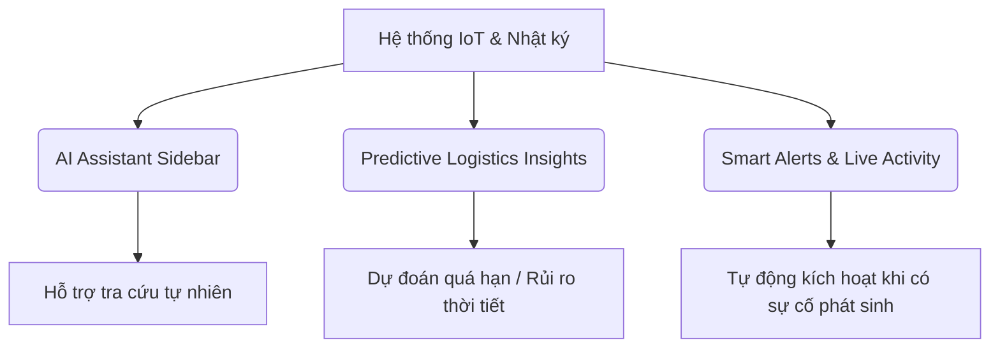
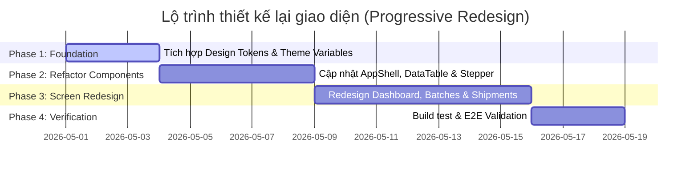

# 📚 Modern Enterprise Supply Chain UI/UX Guidelines

Tài liệu này đóng vai trò là Cẩm nang Thiết kế & Kiến trúc Giao diện (SaaS Design System Guide) cho hệ thống **Mini Supply Chain Traceability**. Định hướng thiết kế được xây dựng theo triết lý tối giản của **Linear, Vercel & Stripe**, tối ưu hóa mật độ hiển thị thông tin và trải nghiệm cho phiên làm việc hoạt động (operations) lâu dài.

---

## 🎨 1. Hệ Thống Token & Spacing (Design Tokens)

### Bảng màu Phân lớp (Color Layering System)
Để đảm bảo chiều sâu thị giác trong Dark Mode mà không tạo ra các đường viền quá sáng (harsh contrast), chúng tôi quy định hệ thống phân lớp màu nền như sau:

| Chế độ | Lớp Nền (Background) | Lớp Panel/Card (Surface) | Lớp Nổi (Popover/Command) |
| :--- | :--- | :--- | :--- |
| **Light Mode** | `#fafafa` (Zinc-50) | `#ffffff` (White) | `#ffffff` + `shadow-md` |
| **Dark Mode** | `#09090b` (Zinc-950) | `#09090b` (Zinc-950) + `border-zinc-800/40` | `#18181b` (Zinc-900) + `shadow-lg` |

### Quy chuẩn viền & Bo góc (Borders & Radius)
- **Borders**: Sử dụng viền siêu mỏng `1px` với opacity thấp để giảm nhiễu thị giác:
  - Light mode: `border-zinc-200/50` hoặc `rgba(228, 228, 231, 0.5)`.
  - Dark mode: `border-zinc-800/40` hoặc `rgba(39, 39, 42, 0.4)`.
- **Radius System**:
  - `rounded-md` (6px): Dành cho nút bấm, ô nhập liệu (`input-field`), dropdowns.
  - `rounded-lg` (8px): Dành cho các hộp chứa panel chính (`card`), modals.
  - `rounded` (4px): Dành cho các nhãn trạng thái (`badges`), mã định danh ngắn.

### Trạng thái Chuỗi Cung ứng (Supply Chain Domain Badges)
Mỗi trạng thái của Lô hàng (Batch) và Vận đơn (Shipment) được ánh xạ sang các cặp màu có độ bão hòa cực thấp (low saturation text & muted background):
- **CREATED**: Nền xám mờ (`bg-zinc-150` / `dark:bg-zinc-800/60`), chữ xám.
- **IN_TRANSIT**: Nền xanh dương nhạt (`bg-blue-50/50` / `dark:bg-blue-950/20`), chữ xanh dương.
- **RECEIVED**: Nền xanh lục mờ (`bg-emerald-50/40` / `dark:bg-emerald-950/10`), chữ xanh lục nhạt.
- **SOLD**: Nền tím nhạt (`bg-violet-50/40` / `dark:bg-violet-950/10`), chữ tím.
- **DISCARDED**: Nền đỏ nhạt (`bg-red-50/40` / `dark:bg-red-950/10`), chữ đỏ.
- **LOST**: Nền cam nhạt (`bg-orange-50/40` / `dark:bg-orange-950/10`), chữ cam.

---

## 🖥️ 2. Thiết Kế Chi Tiết Cho 12 Màn Hình Cốt Lõi (Core Screens)

### 1. Dashboard (Màn hình điều khiển tổng quan)
- **UX Goals**: Cung cấp bức tranh toàn cảnh nhanh gọn về tình trạng tồn kho, luồng hàng đang đi và các sự cố khẩn cấp.
- **Layout Structure**: 
  - Hàng trên: 3 thẻ KPI tối giản hiển thị Tồn kho, Vận đơn đang đi, Sự cố mở.
  - Hàng dưới: Chia đôi (Grid 2 cột) gồm bảng "Recent Shipments" và bảng "Recent Batches".
- **Visual Hierarchy**: Các con số KPI lớn (`text-2xl font-semibold`) làm tiêu điểm chính, nhãn mô tả màu xám nhỏ (`text-2xs font-mono uppercase`).
- **User Flow**: Nhấp vào dòng vận đơn/lô hàng lập tức điều hướng sang trang chi tiết tương ứng.
- **Micro-animations**: Hiệu ứng chuyển dịch nhẹ của Skeleton loading khi tải trang.
- **Adaptive Screen**: Trở thành bố cục 1 cột dọc trên thiết bị di động, rút gọn các cột thứ yếu của bảng dữ liệu.

### 2. Shipment Tracking (Chi tiết vận đơn & Sơ đồ di chuyển)
- **UX Goals**: Theo dõi vị trí và chuỗi hành trình của một vận đơn cụ thể.
- **Layout Structure**: 
  - Phần trên: Tình trạng mã tracking, ngày khởi hành, người tạo.
  - Phần dưới: Sơ đồ di chuyển mạng lưới dạng ngang nối liền 2 Node (Source Node ────→ Destination Node).
- **Visual Hierarchy**: Trạng thái vận đơn nổi bật góc phải (`StatusBadge`).
- **Interactive Flow**: Nút "Xác nhận nhận hàng" (Confirm Receipt) chỉ hiển thị cho nhân viên ở Node nhận.
- **Animations**: Mũi tên chỉ hướng di chuyển chuyển động nhẹ chớp tắt.

### 3. Orders (Quản lý đơn hàng & Điều phối)
- **UX Goals**: Quản lý các yêu cầu điều động phân phối vật tư giữa các node.
- **Layout**: Bảng dữ liệu mật độ cao, tích hợp cột xem nhanh thông tin lô hàng được liên kết.
- **State States**:
  - *Empty State*: Hiển thị hộp nét đứt bo góc chứa thông điệp "Chưa có đơn hàng nào cần xử lý".
  - *Error State*: Banner viền cam nhạt báo lỗi tải dữ liệu từ máy chủ.

### 4. Warehouse Management (Quản lý kho bãi & Tồn kho)
- **UX Goals**: Theo dõi dung lượng chứa và chi tiết các lô hàng đang lưu kho tại từng node.
- **Layout**: Thẻ Widget thống kê sức chứa ở thanh bên, bảng chi tiết tồn kho ở vùng trung tâm.
- **User Flow**: Nhân viên chọn node để xem tồn kho khả dụng hiện tại.

### 5. Fleet Management (Quản lý đội xe)
- **UX Goals**: Kiểm soát danh sách phương tiện vận tải đang hoạt động.
- **Layout**: Grid Cards hiển thị biển số, loại xe và trạng thái hoạt động (Đang chạy, Đang bảo dưỡng).

### 6. Driver Management (Quản lý tài xế)
- **UX Goals**: Quản lý ca trực, thông tin liên lạc và giấy phép của tài xế.
- **Layout**: Danh sách dạng danh bạ (dense list) kèm avatar tròn tối giản, click vào mở Drawer chi tiết bên phải.

### 7. Reports & Analytics (Báo cáo & Thống kê nâng cao)
- **UX Goals**: Xuất dữ liệu báo cáo dạng nhị phân và hiển thị biểu đồ phân tích xu hướng.
- **Layout**: Widget xuất báo cáo (lựa chọn Report Type và Format PDF/CSV), biểu đồ Recharts tối giản ở vùng dưới.
- **Chart Style**: Cột biểu đồ (Bars) sử dụng màu xám Zinc đậm hoặc trắng tương phản, loại bỏ lưới nền rườm rà.

### 8. Notifications (Trung tâm thông báo)
- **UX Goals**: Cảnh báo tức thời về sự cố lô hàng hoặc vận đơn quá hạn.
- **Layout**: Dropdown nổi trên Header hoặc trang danh sách thông báo sắp xếp theo dòng thời gian.
- **Interactive**: Nhấp chọn đánh dấu đã đọc hoặc chuyển nhanh tới sự vụ liên quan.

### 9. Admin Panel (Quản trị hệ thống)
- **UX Goals**: Phân quyền, cấu hình node và quản lý tài khoản người dùng.
- **Layout**: Thiết kế tab ngang (Tabs) chia thành: Users, Nodes, Products.

### 10. Audit Logs (Nhật ký kiểm toán)
- **UX Goals**: Truy vết toàn bộ lịch sử thay đổi dữ liệu của hệ thống phục vụ an toàn thông tin.
- **Layout**: Bảng nhật ký kiểm toán kèm modal so sánh thay đổi nâng cao (Diff Viewer).
- **Diff Style**:
  - Dòng bị xóa: Nền đỏ nhạt, chữ đỏ gạch ngang (`bg-red-50/50 text-red-600 line-through`).
  - Dòng thêm mới: Nền xanh lục nhạt, chữ xanh lục (`bg-emerald-50/50 text-emerald-600`).

### 11. Product CRUD (Danh mục sản phẩm)
- **UX Goals**: Khởi tạo và quản lý SKU sản phẩm.
- **Layout**: DataTable hỗ trợ tìm kiếm theo tên/SKU và bộ lọc danh mục (Category).

### 12. Maps & Live Tracking (Bản đồ giám sát trực tuyến)
- **UX Goals**: Giám sát thời gian thực vị trí các node và luồng vận đơn trên bản đồ địa lý.
- **Layout**: Bản đồ Leaflet phủ kín khung hiển thị, tích hợp Panel điều khiển bay (floating control panel) ở góc trái và Chú giải (legend) ở góc dưới.

---

## ⚡ 3. Enterprise UX Optimizations (Tối Ưu Trải Nghiệm Doanh Nghiệp)

### Mật độ thông tin bảng (Data Density & Table Design)
- Bảng dữ liệu cần nén thông tin cao nhưng không gây mỏi mắt. Cấm sử dụng padding quá dày hoặc chữ quá to.
- Chiều cao dòng tối ưu: Cell padding đặt cố định `py-3 px-4`. Chữ trong bảng đặt ở cỡ `text-[13px]`.
- Định danh độc nhất (Batch Code, Shipment ID) bắt buộc định dạng bằng phông chữ monospace (`font-mono text-xs`) kèm khung nền xám nhạt bo góc để dễ nhận diện và quét mắt.

### Bộ lọc thông minh & Phím tắt (Smart Filters & Keyboards)
- **Filters**: Tích hợp trực tiếp bộ lọc (Dropdown select) song song với ô tìm kiếm trên thanh điều khiển của bảng. Không ẩn bộ lọc trong các menu con phức tạp.
- **Keyboard Shortcut**:
  - Nhấn phím `/`: Tự động focus vào thanh tìm kiếm chính.
  - Nhấn phím `ESC`: Đóng các Modals, Dialogs hoặc đóng thanh Sidebar trên di động.
  - Nhấn phím `CMD + K` (hoặc `CTRL + K`): Kích hoạt Command Palette để tìm kiếm nhanh trang điều hướng hoặc nhập mã lô hàng tra cứu tức thì.

---

## 🤖 4. AI-Style Modern Features (Tính Năng Hiện Đại Kiểu AI)

Chúng tôi đề xuất 3 tính năng hiện đại kiểu AI để đưa vào lộ trình phát triển tiếp theo của sản phẩm:



### 1. AI Assistant Sidebar
- **UX Value**: Cho phép điều phối viên nhập câu lệnh ngôn ngữ tự nhiên để tra cứu nhanh (ví dụ: "Tìm các lô hàng xi măng hết hạn trong tháng 6").
- **ROI Priority**: Medium. Giảm 40% thời gian thao tác lọc thủ công của người vận hành.

### 2. Predictive Logistics Insights
- **UX Value**: Tự động phân tích lịch sử thời gian di chuyển giữa các node và đưa ra cảnh báo sớm về các chặng vận chuyển có nguy cơ trễ hẹn do thời tiết hoặc tắc nghẽn.
- **ROI Priority**: High. Giúp doanh nghiệp chủ động điều phối chặng vận chuyển dự phòng.

### 3. Smart Alerts & Live Activity Feed
- **UX Value**: Dòng tin tức hoạt động thời gian thực (Live feed) ở cạnh màn hình Dashboard, cập nhật ngay khi một vận đơn được xác nhận nhận hàng hoặc có sự cố được báo cáo.

---

## 🧱 5. Kiến Trúc Component (Component Architecture)

Hệ thống được xây dựng trên các component tái sử dụng có cấu trúc props chặt chẽ:

### 1. AppShell
- **Trách nhiệm**: Bao bọc toàn bộ ứng dụng, quản lý layout Sidebar bên trái và Header bên trên.
- **Props**: `children: React.ReactNode`
- **Responsive**: Ẩn Sidebar trên màn hình di động, kích hoạt trượt (Drawer style) khi nhấp nút Hamburger.

### 2. DataTable
- **Trách nhiệm**: Hiển thị lưới dữ liệu nâng cao, hỗ trợ phân trang, sắp xếp và trạng thái loading.
- **Props**:
  ```typescript
  interface DataTableProps<T> {
    data: T[];
    columns: Column<T>[];
    loading?: boolean;
    totalItems: number;
    page: number;
    limit: number;
    onPageChange: (page: number) => void;
    filters?: React.ReactNode;
  }
  ```

### 3. TrackingTimeline (TimelineStepper)
- **Trách nhiệm**: Hiển thị hành trình di chuyển của lô hàng dưới dạng các bước sự kiện dọc tối giản.
- **Props**: `events: TimelineEvent[]`, `loading?: boolean`.

---

## 🗺️ 6. Lộ Trình Triển Khai (Redesign Roadmap)



### Ưu tiên triển khai trước (Quick Wins):
1. Tải và cấu hình biến màu HSL Zinc/Slate vào `theme.css`.
2. Thay đổi style viền mỏng 1px và phông chữ Inter cho `DataTable` và `Card` để lấy ngay cảm giác SaaS cao cấp.
3. Đồng bộ lại cấu trúc Stepper và Timeline để giảm kích thước bong bóng sự kiện.
